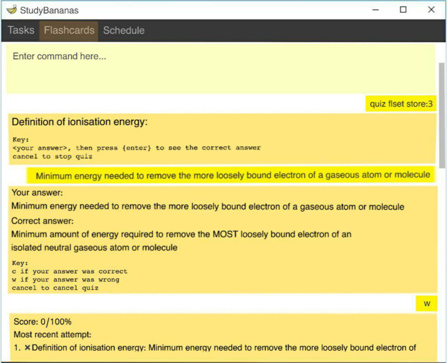

StudyBananas is a **desktop study companion app that helps students centralize all their study tasks and set up focused study sessions into one place, optimized for use via a Command Line Interface** (CLI) while still having the benefits of a Graphical User Interface (GUI).

## About Us
For details on our project team members, do check out the [AboutUs](https://github.com/AY2021S1-CS2103T-F12-2/tp/blob/master/docs/AboutUs.md) page.

## User Guide
Curious to know how to use StudyBananas? We've got you! You may refer to the [User Guide](https://github.com/AY2021S1-CS2103T-F12-2/tp/blob/master/docs/UserGuide.md) for more details.

## Developer Guide
If you would like to contribute to this project, do take  [Developer Guide](https://github.com/AY2021S1-CS2103T-F12-2/tp/blob/master/docs/DeveloperGuide.md).

## Acknowledgments
This project is morphed from the AddressBook-Level3 project, created by the [SE-EDU initiative](https://se-education.org).