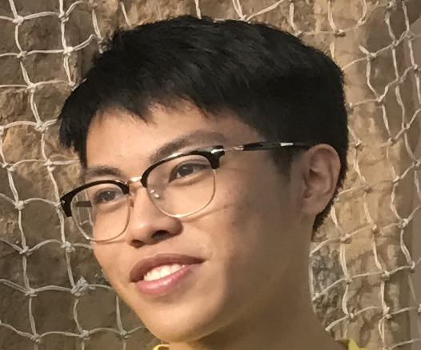

We are a team based in the [School of Computing, National University of Singapore](http://www.comp.nus.edu.sg).

You can reach us at the email `seer[at]comp.nus.edu.sg`

## Project team

### Joe Teddy Yosua Sanjaya

[[github](https://github.com/cupofjoee)]
[[portfolio](team/joeteddy.md)]

* Role: Developer
* Responsibilities: Dev Ops

### Yu Bowei

[[github](http://github.com/bowei-yu)]
[[portfolio](team/yubowei.md)]

* Role: Team Lead
* Responsibilities: UI

### Johnny Doe

[[github](http://github.com/chuyiting)] [[portfolio](team/eddychu.md)]
=======

[[github](http://github.com/chuyiting)] [[portfolio](team/eddychu.md)]

* Role: Developer
* Responsibilities: Data

### Ngo Duc Binh

[[github](http://github.com/ducbinh2611)]
[[portfolio](team/ducbinh.md)]

* Role: Developer
* Responsibilities: Dev Ops + Threading

### James Doe

[[github](http://github.com/johndoe)]
[[portfolio](team/johndoe.md)]

* Role: Developer
* Responsibilities: UI
