* Table of Contents
{:toc}

---

# StudyBananas - Developer Guide

By: `AY2021S1-CS2103T-F12-2`

&nbsp;

## **1. Introduction**

This document is a Developer Guide written for developers who wish to contribute to or extend our project. It is technical, and explains the inner workings of StudyBananas and how the different components of our application work together.

**Reading this Developer Guide**

| Icon | Remarks                                                                 |
|:----:|-------------------------------------------------------------------------|
|   💡  | This icon denotes useful tips to note of during development.            |
|   ❗️  | This icon denotes important details to take note of during development. |

The diagrams in this Developer Guide are colour coded according to the different components.

&nbsp;

## **2. Setting up and getting started**

Refer to the guide [_Setting up and getting started_](SettingUp.md).

&nbsp;

## **3. Design**

### Architecture

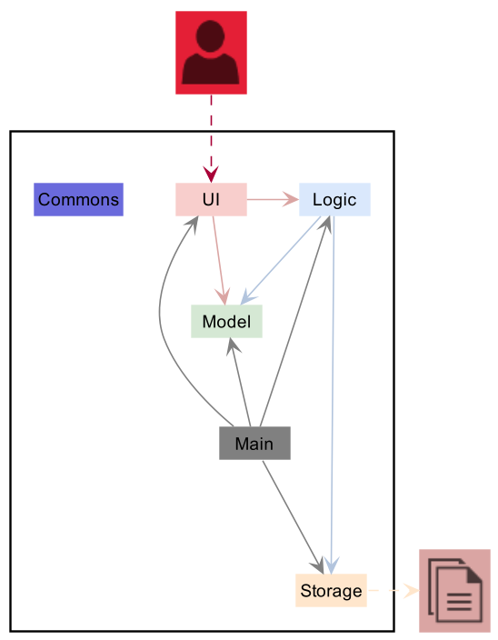

StudyBananas is a brown field project adapted and developed upon **AddressBook3**. Our team decides to reuse the overall architecture by maintaining the system with 6 components (listed in the picture above) but scale each component to cater the need of StudyBananas.
The ***Architecture Diagram*** given above explains the high-level design of the **StudyBananas**, which is inherited from **AddressBook3**. Given below is an overview of each component, we will explain how each component works internally, and how do we scale the system, which can server as a guideline for the developers to expand StudyBananas.

:bulb: **Tip:** The `.puml` files used to create diagrams in this document can be found in the [diagrams](https://github.com/se-edu/addressbook-level3/tree/master/docs/diagrams/) folder. Refer to the [_PlantUML Tutorial_ at se-edu/guides](https://se-education.org/guides/tutorials/plantUml.html) to learn how to create and edit diagrams.

**`Main`** has two classes called [`Main`](https://github.com/AY2021S1-CS2103T-F12-2/tp/blob/master/src/main/java/seedu/studybananas/Main.java) and [`MainApp`](https://github.com/AY2021S1-CS2103T-F12-2/tp/blob/master/src/main/java/seedu/studybananas/MainApp.java). It is responsible for,
* At app launch: Initializes the components in the correct sequence, and connects them up with each other.
* At shut down: Shuts down the components and invokes cleanup methods where necessary.

[**`Commons`**](#common-classes) represents a collection of classes used by multiple other components.

The rest of the App consists of four components.

* [**`UI`**](#ui-component): The UI of the App.
* [**`Logic`**](#logic-component): The command executor.
* [**`Model`**](#model-component): Holds the data of the App in memory.
* [**`Storage`**](#3.5.-storage-component): Reads data from, and writes data to, the hard disk.

Each of the four components,

* defines its *API* in an `interface` with the same name as the Component.
* exposes its functionality using a concrete `{Component Name}Manager` class (which implements the corresponding API `interface` mentioned in the previous point.

For example, the `Logic` component (see the class diagram given below) defines its API in the `Logic.java` interface and exposes its functionality using the `LogicManager.java` class which implements the `Logic` interface.

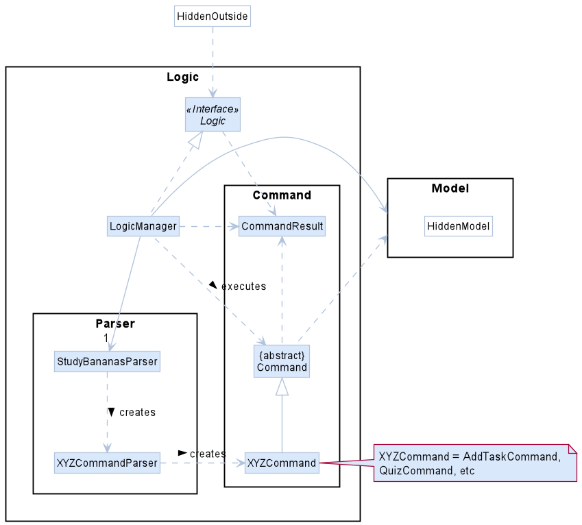

**How the architecture components interact with each other**

The *Sequence Diagram* below shows how the components interact with each other for the scenario where the user issues the command `delete task 1`.

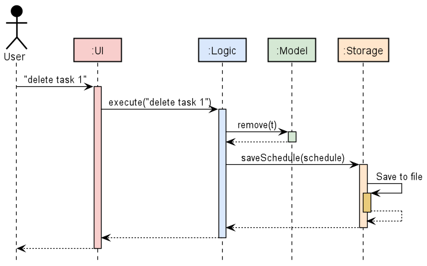

The sections below give more details of each component.

---------------------------------------------------------------------------------------------

### Model

**API** : [`Model.java`](https://github.com/AY2021S1-CS2103T-F12-2/tp/blob/master/src/main/java/seedu/studybananas/model/Model.java)

The `Model`,

* stores the schedule, flashcard, and quiz history data.
* depends on three `ModelManagers`
* does not depend on any of the other three components.

The following paragraphs explain the structure of `Model` component.

#### Overall Structure

StudyBananas is an integration of 3 systems, namely Schedule, Quiz, and Flashcard. As mentioned in  [Architecture](#architecture), we only have one API class (Model) for models from all three systems, this decision incurs strong couplings between three systems, resulting in many regression in the unit tests during the development. Therefore, to solve this problem, we introduce one more layer of abstraction for Model components to reduce the couplings. This section describes our implementation and analysis.

#### Implementation

The following is the step by step guide of how we structure Model component. We believe this structure reduces the coupling for models from different systems and preserves the benefit of **one component, one API**.

Step 1. Create XYZModel interfaces for each system. They work similar as APIs for individual systems, but other components in **StudyBananas** would not access them directly. Instead, we have our API `Model` interface extends from all of them to make sure there is still the only one API class for `Model` component.

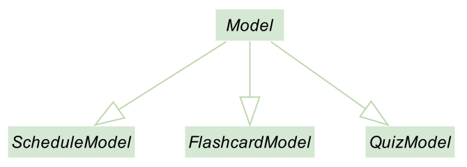

Step 2. Create XYZModelManagers which implement the XYZModel and contain CRUD methods on the persistence data in StudyBananas.

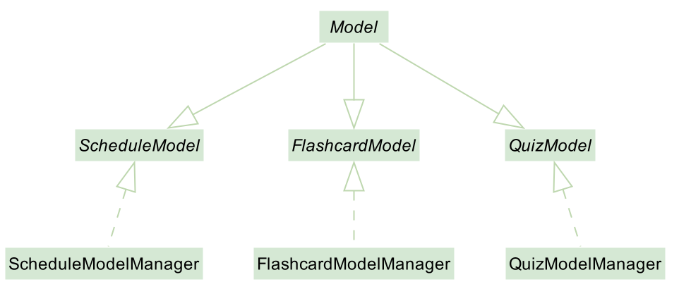

Step 3. Create system-level Models (Schedule, Flashcard, Quiz) which are models that perform CRUD on the data. Then, create a dependency between `XYZModelManagers` and `system-level Models` so that the CRUD methods in `XYZModelManager` can take advantage of them.

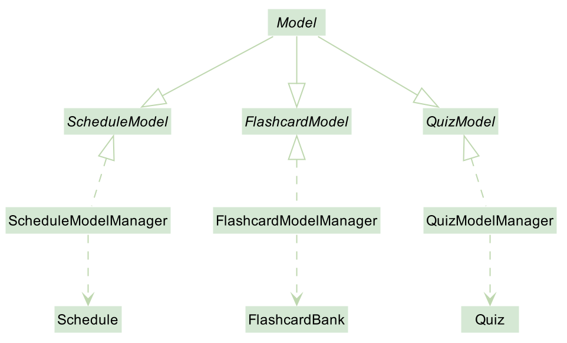

Step 4. Finally, create our **"one and only one"** Model component API class - `ModelManager` which implements the `Model` interface and contains all the ModelManagers. In this way, although the `ModelManager` contains all the CRUD methods from 4 individual `Models`. It can be viewed as a dummy class which does not contain any implementation. All implementations are in the individual `ModelManagers`. Therefore, we are able to test the real implementation of one `Model` without the interference from other `Models`.

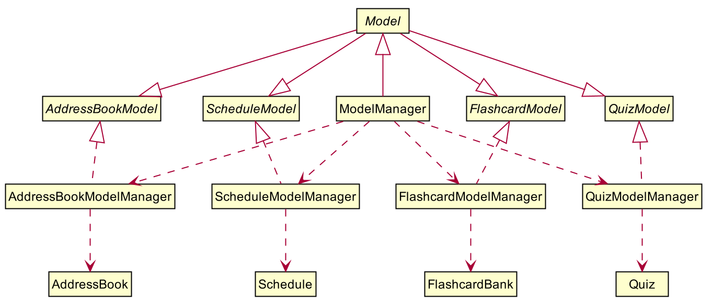

#### Analysis

  * Pros: 
    1. It preserves the advantage of easy and fast cooperation for people working on different components because there is only one API class required to work together.
    2. It solves the problem that testers have to implement unrelated methods for `ModelStub` and avoids regression on unit tests of other `Model` when one `Model` is modified. Therefore, `Model` no longer breaks **Interface Segregation Principle**.
    3. Although adding new systems still requires adding methods in the Model interface, it makes sure that there is no need to modify other `Model` and new `Model` can be included easily by having `Model API` extend it. Therefore, it meets the **Open-Closed Principle**.
  * Cons: 
    1. It still breaks the **Single Responsibility Principle**, for `Model`is no longer responsible for one model at a time, it holds accountable for models from 3 systems at the same time.

#### Structure for individual `Model`

#### ScheduleModel

  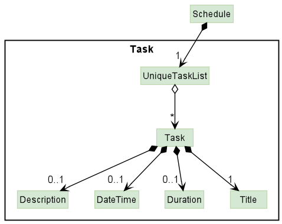

#### FlashcardModel

  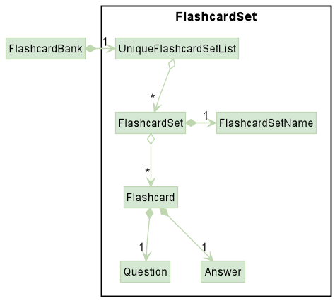

#### QuizModel

  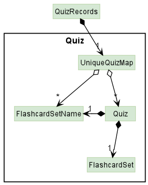

---------------------------------------------------------------------------------------------

### UI component

**API** :
[`Ui.java`](hhttps://github.com/AY2021S1-CS2103T-F12-2/tp/blob/master/src/main/java/seedu/studybananas/ui/Ui.java)

The UI consists of a `MainWindow` that is made up of parts e.g.`CommandBox`, `ResultDisplay`, `PTaskListPanel` etc. All these, including the `MainWindow`, inherit from the abstract `UiPart` class.

The `UI` component uses JavaFx UI framework. The layout of these UI parts are defined in matching `.fxml` files that are in the `src/main/resources/view` folder. For example, the layout of the [`MainWindow`](https://github.com/AY2021S1-CS2103T-F12-2/tp/blob/master/src/main/java/seedu/studybananas/ui/MainWindow.java) is specified in [`MainWindow.fxml`](https://github.com/AY2021S1-CS2103T-F12-2/tp/blob/master/src/main/resources/view/MainWindow.fxml)

The `UI` component,

* Executes user commands using the `Logic` component.
* Listens for changes to `Model` data so that the UI can be updated with the modified data.

The following paragraphs explain the structure of `UI` component in detail.

#### Overall Structure

StudyBananas contains three pages for three different systems. A user can navigate between different systems by entering commands or clicking on the tabs. Compared with **AddressBook3**, StudyBananas has a much higher complexity for **`UI`** component for the reason that StudyBananas supports navigation through clicking, which would require a **state management** structure to realize.

Our team divides `UI state` into two categories and manage their changes in two different ways, the following table provides the definition of these two types of state.

| Terminology         | Definition                                                                                                                                                                                        |
| ------------------- | ------------------------------------------------------------------------------------------------------------------------------------------------------------------------------------------------- |
| Static State        | The objects that would be used in many `UI` components, but either there wouldn't be any changes made to them or they might be changed, but no components listen to their changes.                | 
| Dynamic State       | The objects related to any reactive UI behavior. In other words, multiple components listen to the changes of them and we would expect view updates from the components when the state is changed.|                                                                                              |
 
For the reason that these two states have intrinsic difference in their complexity (`dynamic state` is much more complicated than the `static state`), we handle them differently in `UI` component. The following paragraphs explain our implementation on them separately.
 
#### **Static State**

#### Reasoning

When our team starts to improve the user experience of the graphical user interface, the first pain that came to our notice is that many components have the need for certain objects(`static state`), but due to the fact that `Ui Components` tend to nest each other, the developer might need to pass the object(`static state`) down to a deep nested component. 
For example, many components take advantage of `Logic` object to communicate with the persistence data in `Model` component to provide accurate view of data.
The picture below is the simplified class diagram for `Ui Components`, and the `Components` with pink color depend on the `Logic` object. The red path is the deepest path that `Logic` object would need to be passed. You can observe the deep nested dependency in the graph.

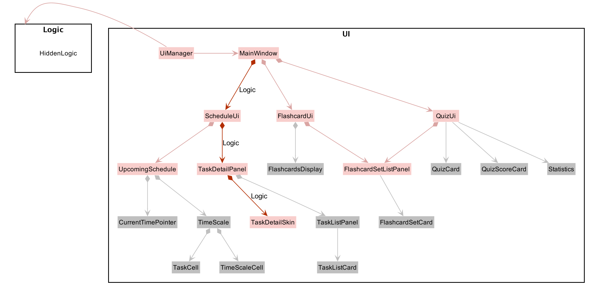

#### Implementation (Solution)

The most intuitive solution is to make those `static states` globally accessible to every `Component`. By doing this, the `static state`  does not need to be passed. Instead, only the `components` that require the `static state` need to depend on it. The following paragraph shows the step-by-step guide of the implementation. 

Step1. Create a class named `GlobalState` and make it singleton, and set the `static states` as the attributes of `GlobalState`. Then, use the set method to set the attribute of the `GlobalState` in the component where the `static state` is first created so that we are certain that when other components try to get the `static state` from the `GlobalState`, the `static state` has already been registered in the `GlobalState`.

:information_source: Note: our static state can still be modified, (see the definition from [overall structure](#overall-structure)) that is why `GlobalState` has to be singleton.
    

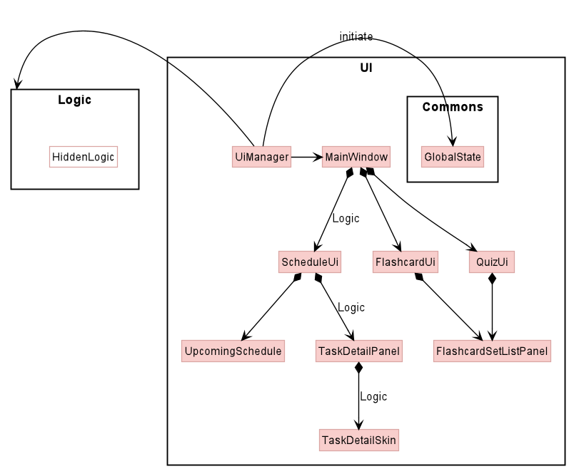

Step2. Have the components that require the `static state` depend on the `GlobalState` to fetch and update the `static state` easily.

:information_source: Note: in the picture, there is no need to pass the `static state` around anyone, the structure is thereby flatten.
    

    
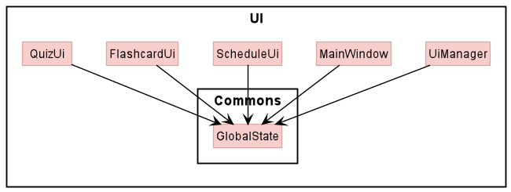

#### Analysis

  * Pros: 
    1. This structure makes it easier for the developer to maintain the `Ui components` because there is no need to pass `static state` as arguments for the constructor anymore
    2. It avoids dummy arguments in some constructors. For example, given the following component structure A -> B -> C, if A and C both require a common `static state`, in the original implementation, the constructor in B would need to have one more argument for the `static state` which is not used in `Component B` except for constructing `Component C`. In this sense, the `static state` is dummy inside the constructor B.
  * Cons: 
    1. Every component is able to get access and modify the `static state`, the modification done to a `static state` in one class by a developer can cause unexpected behavior when another developer is using the same `static state` in other components.
    

:information_source: Note: the idea of `GlobalState` is inspired by 
    [Redux](https://redux.js.org). It has a much more complicated structure than what we have here.
    

#### **Dynamic State**

#### Reasoning

In the UI design phase, our team decided to build a sidebar and expected it to allow user to navigate through different pages by clicking. It was the first time that we found out that there are multiple components listening to the changes of the `PageState` and there is a need for them to update their view based on the `PageState`.
Therefore, an intuitive solution would be **observer pattern**. In which we have the components that subscribe to the changes of the `dynamic state` be the **Observer**, while the target **`dynamic state`** would be the **Observable** object.
Nonetheless, as the complexity of the `UI` increased, the original structure is not enough to solve the reactive behavior as some components would have a need to subscribe to multiple `dynamic states`, while simple observer pattern only allows
the `observer` to subscribe to one `observable` object because implementing Observer &lt;T&gt; and Observer &lt;U&gt; at the same time is not allowed in **java**. 
In the end, we decided to create mediator classes named `Listeners` which subscribe to **one** specific `dynamic state`, and have the `Component` which originally need to subscribe to more than `dynamic states` depend on multiple `Listeners`.
However, the change of the `static state` should update the view for the `Component`. Before introducing `Listeners`, the view update is specified in the `Component` itself, as now we pass the responsibility of subscribing to the `Listeners`, the `Listeners` would then be in charge of
the update of the the `Component`'s view. To quip `Listeners` with the ability to update the view, the `Component` created a `CallBack` and passed it as argument when creating the `Listeners`.

#### Implementation 

Step1. Create `CallBack` object inside the `UiComponent`. In the `CallBack`, we specify how the view of the `UiComponent` is supposed to changed on the update of the `dynamic state`. Then construct a `Listener` with the `CallBack` being the argument to finish the process of subscribing. The picture below shows the dependency between them.

  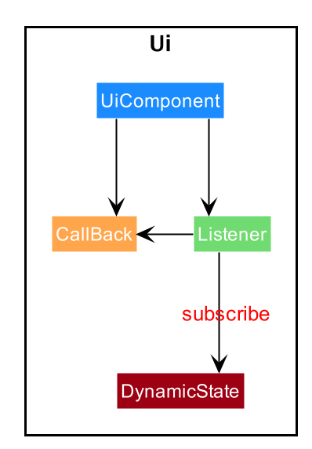

Step2. When the `dynamic state` is updated, it will then inform all the `Listeners`, and the `Listeners` would consequently change the view of the `UiComponent` by triggering the `CallBack`. The following two diagrams show the flow.

#### Flow

  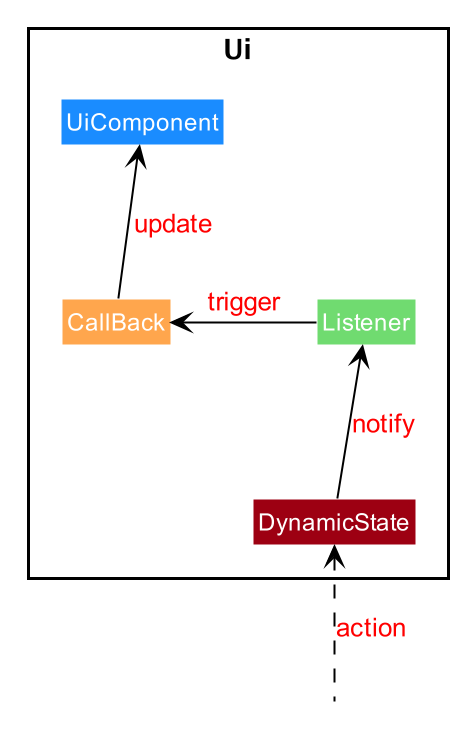

#### Sequential diagram

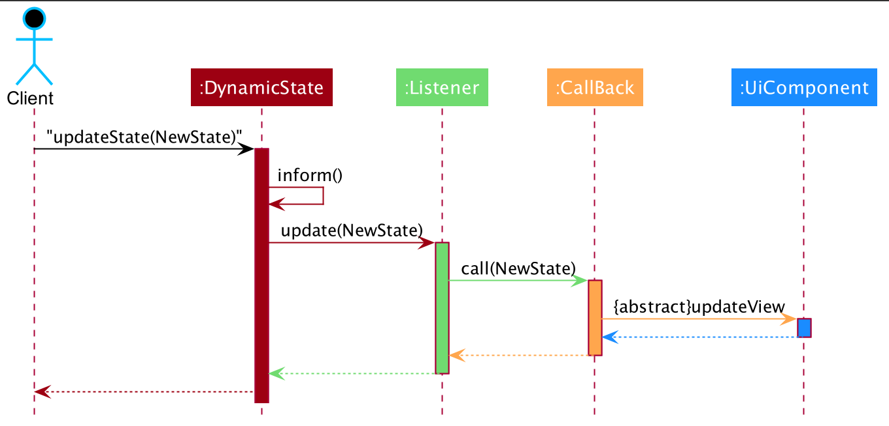

:information_source: Note: the listener structure is built to cater the need of subscribing to multiple `dynamic state`, in some `Component`, multiple subscription is not needed, we keep it as normal **observer pattern**. Refer to [sidebar implementation](#Sidebar View) for the example of subscribing to only one `dynamic state`.
    

#### Structure for individual `Ui` page

The following paragraphs provide the class diagrams of the three `Ui` pages. Developers can refer to these diagrams to scale the system.

#### `ScheduleUi`

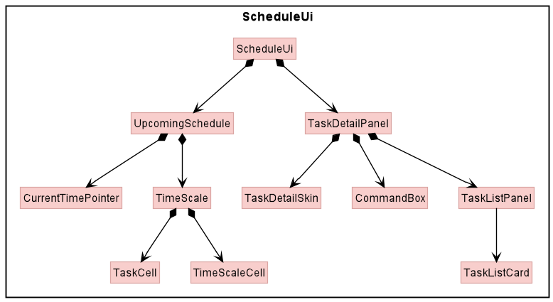

#### `FlashcardUi`

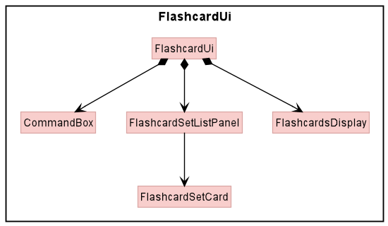

#### `QuizUi`

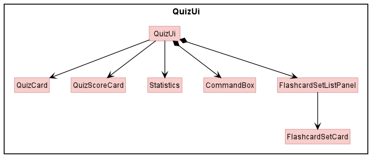

--------------------------------------------------------------------------------------------

### **3.3. Logic component**

Figure __. Structure of the logic component

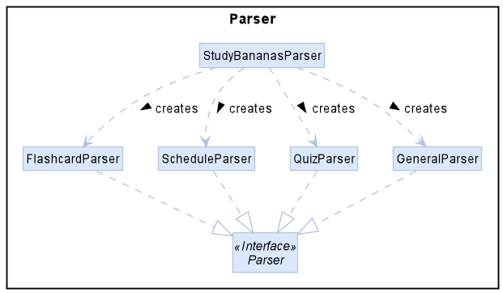

Figure __. Structure of the StudyBananasParser

**API** :
[`Logic.java`](https://github.com/AY2021S1-CS2103T-F12-2/tp/blob/master/src/main/java/seedu/studybananas/logic/Logic.java)

1. `Logic` uses the `StudyBananasParser` class to parse the user command.
1. This results in a `Command` object which is executed by the `LogicManager`.
1. The command execution can affect the `Model` (e.g. adding a task).
1. The result of the command execution is encapsulated as a `CommandResult` object which is passed back to the `Ui`.
1. In addition, the `CommandResult` object can also instruct the `Ui` to perform certain actions, such as displaying help to the user.

Given below is the Sequence Diagram for interactions within the `Logic` component for the `execute("delete task 1")` API call.

Figure 3.3: Interactions inside the Logic Component for the `delete task 1` Command

 ❗ **Note:** The lifeline for `DeleteCommandParser` should end at the destroy marker (X) but due to a limitation of PlantUML, the lifeline reaches the end of diagram.

&nbsp;

### **3.6. Storage component**

**API** : [`Storage.java`](https://github.com/AY2021S1-CS2103T-F12-2/tp/blob/master/src/main/java/seedu/studybananas/storage/Storage.java)

The `Storage` component,
* can save `UserPref` objects in json format and read it back.
* can save the `Schedule`, `FlashcardBank` and `QuizRecords` data in json format and read it back.

#### Overall Structure
StudyBananas supports 3 different systems, namely `Schedule`, `FlashcardBank` and `Quiz`. Each of these
systems needs to store their own type of data. Compared to the original `AddressBook3` where `AddressBookStorage` is the
interface that exposes the functionality to save and read the data from the storage file, StudyBananas storage
is more complicated with the existence of these 3 distinct systems. Therefore, our team decides to split the 
storage such that each system has their own storage interface, including `ScheduleStorage`, `FlashcardBankStorage` and
`QuizRecordsStorage`, that is in charge of saving and reading their own data from their respective storage file as seen from the figure below
. The `Storage` 
component then contains these 3 storage systems as well as the `UserPrefs` storage and exposes the storage functionality 
to other components such as `Logic` to modify the stored data.

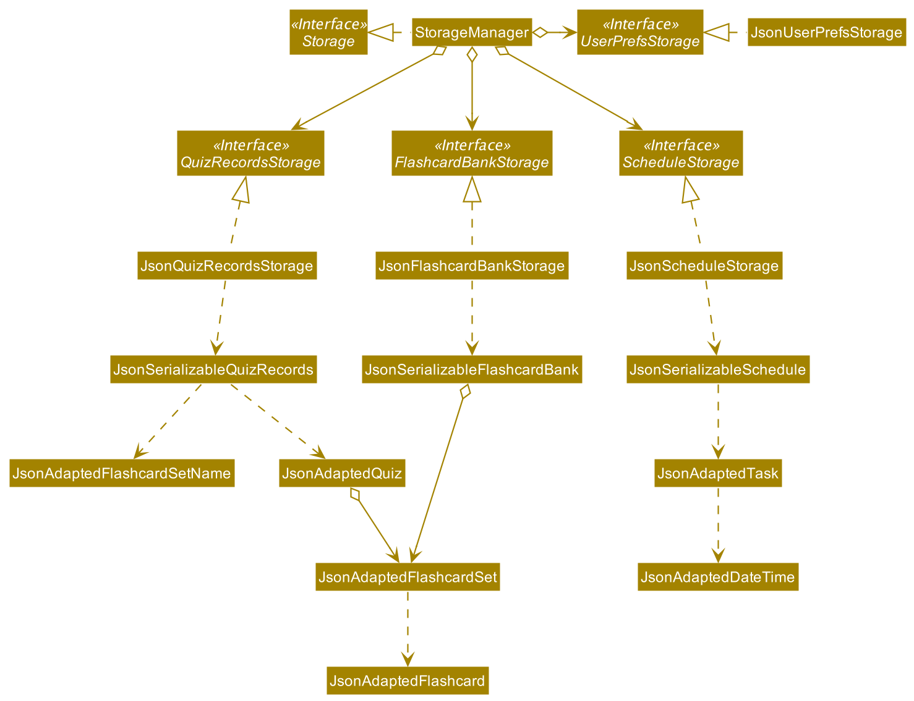

#### Analysis
* Pros: 
    1. It allows to have one high-level `Storage` components that interacts with other high-level components in the architecture level.
    2. **Interface Segregation Principle** is preserved as each system storage only needs to deal with the reading and saving data of its own system.
    3. **Open-Closed Principle** is preserved for `Storage` component. If more components are added, developers only need to extend by creating `XYZStorage` and add a new attribute and methods to `Storage` component instead of modifying existing `XYZStorage`.
 * Cons: 
    1. If there is a common data that is shared between different systems and it is modified, `Logic` needs to have multiple calls of save to each 
    systems have to update the data in different systems.
    

&nbsp;

### **3.7. Common classes**

Classes used by multiple components are in the `seedu.studybananas.commons` package.

--------------------------------------------------------------------------------------------------------------------

## **4. Implementation**

This section describes some noteworthy details on how certain features are implemented.

### [Proposed] Flashcard

#### Proposed Implementation

The proposed mechanisms to manage is facilitated by `FlashcardBank`. The `FlashcardBank` contains a list of `FlashcardSet`. Each `FlashcardSet` contains a list of `Flashcard`.

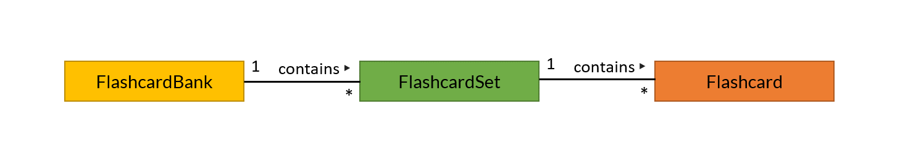

### Support multiple DateTime format feature

#### Implementation

StudyBananas is optimized for command line users, and supports multiple formats of input date 
time (see [add-a-task]("https://ay2021s1-cs2103t-f12-2.github.io/tp/UserGuide.html#312-add-a-task-add-task") 
to find out all the time formats that StudyBananas supports). As the number of supported date time format increases,
a scalable structure is then proposed. The picture below describes the overall structure.

  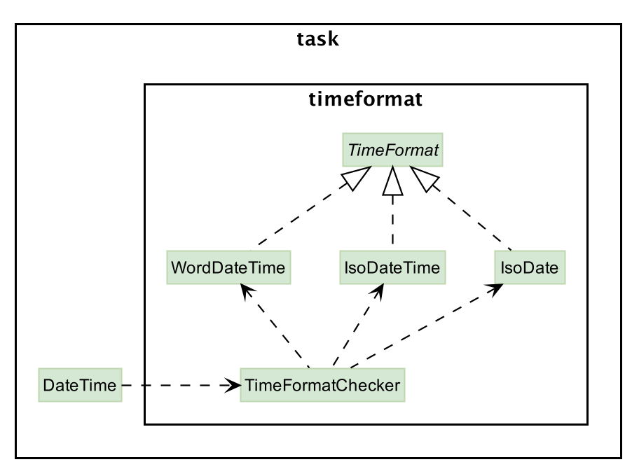

Each `Format` implements `check` method from `DateFormat` interface. The `check` method checks if the input string
matches the pattern of the `Format` class. If the format matches, it would transform input string into `LocalDateTime` object; 
otherwise it throws `TimeFormatException`. The `TimeFormatChecker` is the API that communicates with `DateTime` class.
It contains all the available `Formats`, and helps `DateTime` `check` if the input string matches anyone of the `Format`.
If the input string matches one of the `Formats`, it takes advantage the `DateFormat#check` to map the string into `LocalDateTime` 
for `DateTime` object. The following paragraph provides the step-by-step guide to support one more time format for StudyBananas.

Step1. Create a `Format` class for the desired date format, and have it implement the `DateFormat` interface. 
Then, specify the check logic in the `check` method.

  

Step2. Add the new `DateFormat` into the check list residing in the `TimeFormatChecker` class.

  

#### Design consideration:

##### Aspect: How is multiple time format implemented

* **Current choice** .
  * Pros: It segregates the check logic from the `DateTime` format. In a sense, this is a good practice of 
  **Single responsibility principle** as the check process is divided into three classes. Each is only in charge of one task.
  * Cons: As the supported format increases, a lot more classes and tests will need to be maintained. The efforts required
  to put into the maintenance is the major overhead.
  
* **Alternative choice** : Have a almighty checker class which checks all the available formats in one class instead of creating multiple classes for multiple supported `Format`
  * Pros: It reduces the number of classes and tests to maintain, and if the logic inside the `Checker` class is written neatly, it would be easy to test as all format should go through similar happy paths.
  * Cons: Harder to debug and would have a much fatter class compared with the current implementation.

### Edit Task feature

#### Implementation

The edit mechanism is facilitated by `Schedule`, which contains a `UniqueTaskList` such that each `TASK`'s information can be modified 
after its creation and addition into the `UniqueTaskList`. It implements this following feature:  

* `Schedule#setTask()` — Replaces an existing task in the `Schedule` with a new task.

This operation is exposed in the `ScheduleModel` interface as `ScheduleModel#setTask()`.

Given below is the example usage scenario and how the edit task mechanism behaves at each step.

Note: The attributes of the `TASK`s in this examples are omitted if they are not changed due to the `edit task` 
functionality. Given below is the class diagram of `TASK` model for a better understanding of this example.

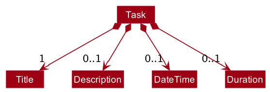  
  
 

Step 1. The user launches the application. The `SCHEDULE` contains `UniqueTaskList`, which is initialized from the saved 
 `TASK`s in the JSON file `schedule.json` locally (see [Storage component](#storage-component))
For example, the user already has 3 `TASK`s saved in the initial `SCHEDULE` as seen below.

  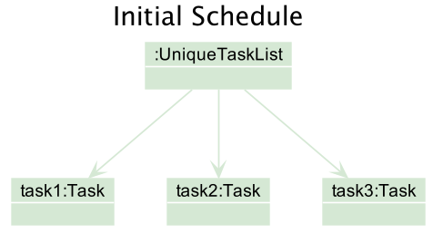

 

Step 2. The user adds a new `TASK` into the schedule using the `add task` command. 
This `TASK` is assigned the index 4 in the `SCHEDULE`

  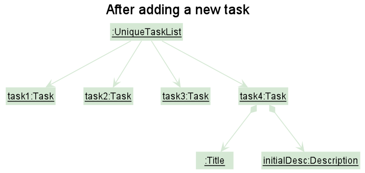

 

Step 3. The user now wants to change the description of the currently added `TASK`, and decides to edit the description of the `TASK` by entering the command `edit task 4 d: Quiz 3 about Boolean Algebra`. 
The `edit task` command will be parsed by the `Parser` and create a `ScheduleEditCommand` object. `ScheduleEditCommand#execute()` 
creates a new `TASK` object, containing the updated information fields. For the fields that is not specified in the `edit task` command, such as `title` in the example, the new `TASK` 
takes the existing fields of the to-be-replaced `TASK` (note how the same `title` object is shared between `task4` and `editedTask4` as seen below). 

  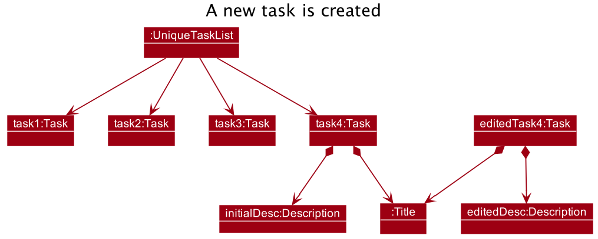

 

Step 4. `ScheduleModel#setTask()` is then called to replace `task4` with `editedTask4` in `Schedule`.

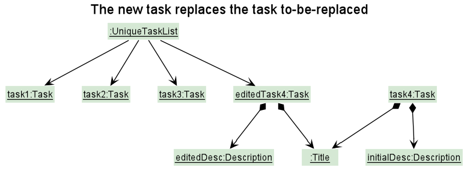 

:information_source: **Note:** `ScheduleEditCommand#execute()` creates a new `TASK` sharing some of the attribute object with the to-be-replaced `TASK`. Then `ScheduleModel#setTask()` sets the to-be-replaced `TASK` with the newly created `TASK` at index 4 of the `SCHEDULE`.  

 

The following sequence diagram shows how the `edit task` functionality works:

 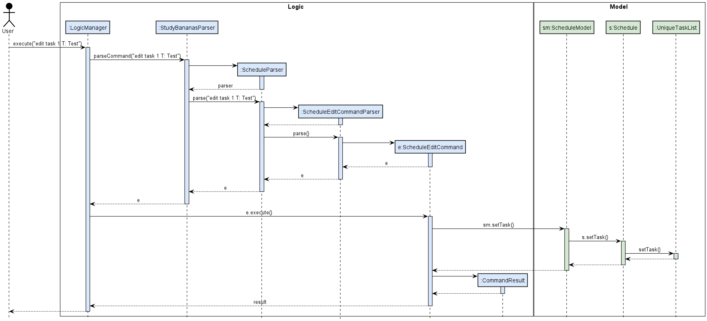

#### Design consideration:

##### Aspect: How edit task executes

* **Alternative 1 (current choice):** Creates the new edited task object to replace the to-be-replaced task object.
  * Pros: Update the `SCHEDULE` by modifying `UniqueTaskList` consistently throughout the program so that side-effects, such as the existence of 2 different
   versions of `SCHEDULE`, can be avoided.
  * Cons: May have performance issues in terms of memory usage as the replaced task object still remains in the memory. 
  However, this is not a big issue as Java supports automatic memory management and the run-time memory usage of the program
  is not large.

* **Alternative 2:** Mutates the `TASK` object itself in the `SCHEDULE` at the corresponding index.
  * Pros: Will use less memory as there is no new creation of `TASK` object.
  * Cons: May result in side-effects such as there are out-of-dated versions of `SCHEDULE` throughout the program.

### Quiz with storage of answers feature

#### Implementation

The proposed quiz with storage of answers mechanism is facilitated by `Quiz` and `QuizModelManager`, which implements the `QuizModel` interface. 
It makes use of an array of answer strings as an attribute, stored within a `Quiz` object as `userAnswers`.
Additionally, it implements the following core operations with `Quiz`, which is called by `QuizModelManager`:

* `QuizModelManager#start(Quiz quiz)` — Starts the quiz by initiating the quiz object in the model, 
iterating through the associated flashcard set and showing the first question in the flashcard set.
The presence of at most one quiz object ensures that at most one quiz running at a time.

* `QuizModelManager#hasStarted()` — Checks if a quiz has started. 
This prevents multiple quizzes from running concurrently.

* `QuizModelManager#tallyScore(boolean isCorrect)` — Tallies the score after each answer is shown, 
depending on user's judgement of correctness.

* `QuizModelManager#getQuestion()` — Obtains the question of the next flashcard in the flashcard set.

* `QuizModelManager#getAnswer()` — Obtains the answer of the next flashcard in the flashcard set.

* `QuizModelManager#stopQuiz()` — Stops the quiz. This method is called at the end of the flashcard set iteration. 

* `QuizModelManager#cancelQuiz()` — Cancels the quiz. 
This method is called when the user cancels the quiz before reaching the end of the flashcard set.

* `QuizModelManager#getQuizRecords(FlashcardSetName name)` — Fetches the quiz score based on the associated flashcard set's name. 
The score includes: 
    * the number of correct answers out of the total score within the flashcard set, and percentage scored.
    * the set of questions, the corresponding correct answers and the answers provided by the user
    * whether each question was answered correctly.

These operations are as exactly written in the `QuizModel` and `Model` interface.

#### Usage Scenario
Given below is an example usage scenario and how the quiz with storage of answers mechanism behaves at each step.

##### Step 1
The user launches the application and starts the quiz for a non-empty, valid flashcard set. 
As a result, it creates a `QuizModelManager` object and a `StartCommand` object.
Assume the flashcard set contains only two flashcards for simplicity.

The call to `StartCommand#execute()` from `Logic` will allow the `Quiz` to be initialized with the initial quiz state with default values for score, 
the `currentIndex` pointing to the index of the first flashcard, 
and the current command result being the first question through the call of `Quiz#getQuestion()`.

The `Quiz` is saved into the `QuizModelManager`object as an attribute named `quiz`.

  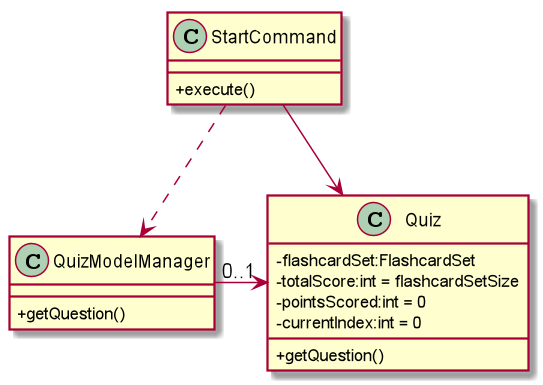

  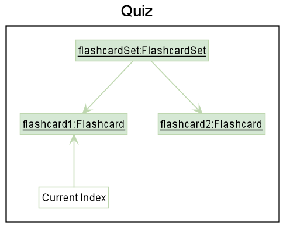

##### Step 2
The user executes `ans:<answer>` command to submit their answer to the question. 
The `AnswerCommand` object created calls `Quiz#saveAnswer()`, 
storing their answer into the `userAnswers` array attribute in Quiz 
for the question before moving on to the correct answer through the call of `Quiz#getAnswer()`.

The `currentIndex` attribute is incremented at this stage to point to the next flashcard.

  

##### Step 3
After viewing the answer, the user executes either `c` or `w` to indicate whether the question is answered correctly. 
This creates either a `CorrectCommand` or `WrongCommand` object. 

In the case of the `CorrectCommand` class below, the call to `CorrectCommand#execute()`
calls the `Quiz:tallyScore()` method through the interaction with `QuizModel`.
This increments the `pointsScored` attribute in quiz. Also, the next question is fetched through
the call to `Quiz:getQuestion()`.

The following sequence diagram shows how this step works:

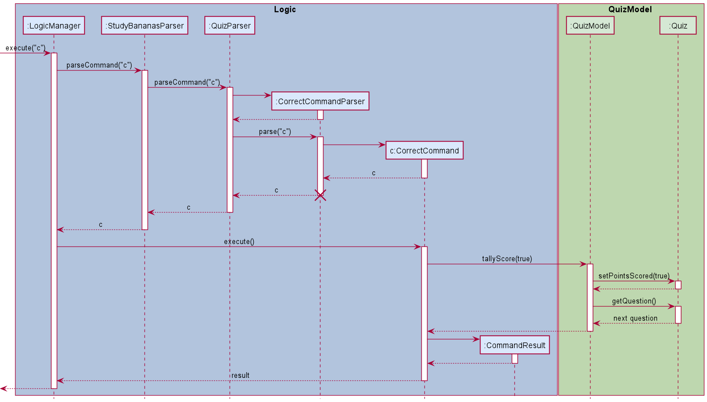

The object created will check if the `currentIndex` (updated in the previous step) 
is within bounds to obtain the next flashcard.

:information_source: **Note:** If there are no flashcards left, the quiz exits.

 

In the current scenario, the question of the next flashcard is fetched and displayed
by calling the `Quiz:getQuestion()` method,
through `QuizModelManager`, during the execution of `CorrectCommand:execute()`.

  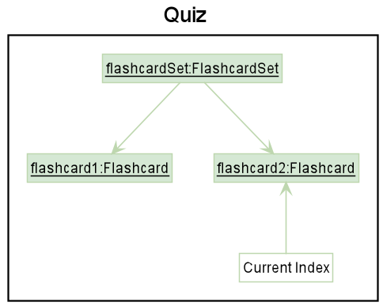

##### Step 4
Assume that the user has reached the end of the flashcards as shown below:

  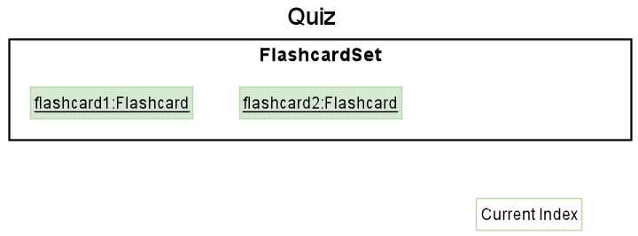

From the `CorrectCommand:execute()` / `WrongCommand:execute()` operation, 
the `QuizModelManager:stopQuiz()` operation will be called.
This stops the quiz by removing the `Quiz` object stored in the `quiz` 
attribute of `QuizModelManager`.

This leads to also calling the `Quiz:toString()` operation to show the quiz score and statistics.

The following activity diagram summarizes what happens when a user executes a new command:

  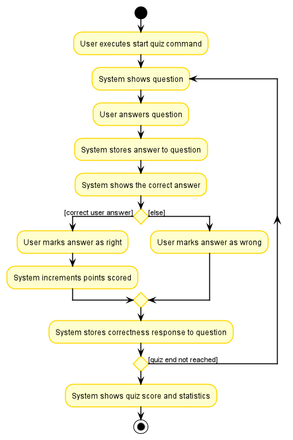

#### Design consideration:

##### Aspect: How quiz with storage of answers executes

* **Current choice** .
  * Pros: Easy to implement.
  * Cons: May have performance issues in terms of memory usage.
_{more aspects and alternatives to be added}_

### Sidebar view

#### Implementation

Sidebar view is implemented with the `dynamic state` structure (see [`Dynamic State`](#dynamic-state)) with `SingletonUiState` being the **Observable** object and `MainWindow` and `SidebarTab` being the **Observers**. As `MainWindow` and `SidebarTab` do not subscribe to other `dynamic states`. The `listener` is omitted here. The `SingletonUiState` is designed to be **singleton**, and default value `SCHEDULE` is assigned to it when the application is launched; Both `MainWindow` and `SidebarTab` implement the **Observer** interface and specify how their view should be changed in the `update` method. The list below describes how **Observer** pattern is adopted here.

* `Observable#register(Observer o)` — Register a certain Observer to an Observable object, after registration, the observer object will be notified on any update of the Observable object.
* `Observable#inform()` — When the observable object is modified, use this method to inform all the subscribed observers.
* `Observer#subscribe(Observable o)` — Help the Observer class subscribes to an Observable Object.
* `Observer#update()` — This is the API for the Observer object to modify the Observable object and further helps inform all the subscribers.

The concrete implementation of these methods lies in the `MainWindow`, `SidebarTab`, and `SingletonUiState`, with `MainWindow` and `SidebarTab` being `Observer` and `SingletonUiState` being Observable

Given below is an example usage scenario and how the sidebar view mechanism behaves at each step.

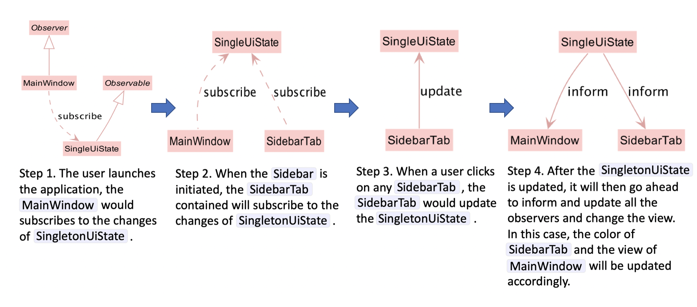

#### Design consideration:

* Multiple Ui components rely on the unique `UiState`. This is the intuition for **Singleton**.
* Many components should be updated according to the  changes of `UiState`, it makes sense to build it using Observer pattern.

--------------------------------------------------------------------------------------------------------------------

## **Documentation, logging, testing, configuration, dev-ops**

* [Documentation guide](Documentation.md)
* [Testing guide](Testing.md)
* [Logging guide](Logging.md)
* [Configuration guide](Configuration.md)
* [DevOps guide](DevOps.md)

--------------------------------------------------------------------------------------------------------------------

## **Appendix: Requirements**

### Product scope

**Target user profile**:

* is a student, at upper secondary or tertiary education level
* has a need to keep track of study tasks and test their understanding of what is learnt
* prefers desktop apps over other types
* can type fast
* prefers typing to mouse interactions
* is reasonably comfortable using CLI apps

**Value proposition**: 
* manage study tasks and test learnt knowledge faster than a typical mouse/GUI driven app
* centralize all study tasks and set up focused study sessions in one place

### User stories

Priorities: High (must have) - `* * *`, Medium (nice to have) - `* *`, Low (unlikely to have) - `*`

| Priority | As a …                                                         | I want to …                                                                                 | So that I can…                                                                     |
| -------- | -------------------------------------------------------------- | ------------------------------------------------------------------------------------------- | ---------------------------------------------------------------------------------- |
| `* * *`  | Student                                                        | take advantage of the flashcard learning technique                                          | memorize important facts/parts of the notes more efficiently and organizedly.      |
| `* * *`  | Learner who takes advantage of flashcard learning              | be able to create custom flashcards                                                         | store my notes in the form of flashcards which optimises my flashcard learning.    |
| `* * *`  | User                                                           | delete my flashcards which are no longer in use                                             | manage my own flashcards.                                                          |
| `* * *`  | Student who learns by tests                                    | test myself                                                                                 | learn more effectively.                                                            |
| `* * *`  | Hard-working flashcard-learning user                           | create tests with the flashcard notes created by myself                                     | see how good my learning outcome is.                                               |
| `* * *`  | User who learns by quizzing his/herself a lot                  | look back on my quiz attempts                                                               | evaluate how much more efforts I need to put in the section.                       |
| `* * *`  | Student who regularly revises my concepts using flashcards     | see the detailed answering history for my past quiz attempts                                | evaluate which concepts are still unclear to me and spend more time on those.      |
| `* * *`  | Student who regularly revises my concepts using flashcards     | see my quiz statistics                                                                      | know which part I do well and where I need improvement on in an objective manner.  |
| `* * *`  | Student who has tons of homework and exams                     | have a to-do list that organizes my study plan                                              | plan my schedule more effectively.                                                 |
| `* * *`  | Student who has a lot of homework and assignments              | create a homework to-do list                                                                | keep track of what tasks I need to complete.                                       |
| `* * *`  | Student who frequently forgets my own homework and assignments | list out all the homework                                                                   | view what to do.                                                                   |
| `* * *`  | Student who wants to look up certain homework and assignments  | search or filter the list of homeworks and assignments                                      | see the information for a specific homework.                                       |
| `* *`    | Savvy learner who wishes to track my study sessions            | schedule my study plan                                                                      | play myself more effectively.                                                      |
| `* *`    | Savvy learner who wishes to track my study sessions            | put my todo task in my schedule                                                             | plan my todo tasks more organizedly without missing any deadlines.                 |
| `* *`    | Extremely organised learner                                    | have a timer which runs during the scheduled period of time                                 | make the best use of my time                                                       |
| `* *`    | Student who organises the schedule carefully                   | leave feedback for each of my study session                                                 | know my learning efficiency during each session and make my new plans based on it. |
| `*`      | Super busy student                                             | have AI to schedule my todo lists based on my past studying statistics automatically for me | rely on the AI to make the best use of my time.                                    |

*{More to be added}*

### Use cases

(For all use cases below, the **System** is the `StudyBananas` and the **Actor** is the `user`, unless specified otherwise)  

#### Use case: UC01 Create a set of flashcards
**MSS:**
1. User adds a new empty set of flashcards with a given name.
2. User <ins> UC02 create and add an individual flashcard into a set </ins>
3. Repeat 2 until all flashcards for the set are added.  
Use case ends.

**Extensions:**
* 1a. Missing parameter - empty set name. 
   * a1. StudyBananas shows a missing parameter error message.  
      Use case ends.

#### Use case: UC02 Create and add an individual flashcard into a set
**MSS:**
1. User defines the question and answer of the flashcard.
2. User <ins> UC03 see all existing flashcard sets </ins>.
3. User adds the flashcard to the set using the flashcard set index.  
Use case ends.

**Extensions:**
* 1a. Missing parameter - question, answer or index of the flashcard set.
   * a1. Shows missing parameter error message.  
      Use case ends.

#### Use case: UC03 See all existing flashcard sets
**MSS**
1. User requests for the list of flashcards.
2. StudyBananas shows the list of flashcards.  
Use case ends.

#### Use case: UC04 Delete a flashcard set
**MSS:**
1. User <ins> UC03 see all existing flashcard sets. </ins>
2. User enters the index to delete the set.  
Use case ends.
 
**Extensions**:
* 1a. There are no existing flashcard sets.  
Use case ends.
* 2a. Invalid index
  * a1. StudyBananas shows an error message.  
    Use case ends.
    
#### Use case: UC05 See all flashcards in a flashcard set
**MSS**:
1. User <ins> UC03 see all existing flashcard sets </ins>.
2. User requests for the list of flashcards using a given flashcard set index.
3. StudyBananas shows the list of flashcards for the requested flashcard set.  
Use case ends.

**Extensions**:
* 1a. Flashcard set is not present at entered index.
    * a1. StudyBananas shows an error to indicate the invalid index.  
    Use case ends.

#### Use case: UC06 Delete an individual flashcard from a set    
**MSS**:
1. User <ins> UC05 see all flashcards in a set. </ins>
2. User enter the index of the set and the individual flashcard to delete it.  
Use case ends.

**Extensions**:
* 1a. The list is empty.  
      Use case ends.
* 2a. The given index is invalid.
    * a1. StudyBananas shows an error message.  
   Use case resumes at step 2.

#### Use case: UC07 Quiz of flashcard set (no storage of answer)
**MSS**
1. User requests a quiz of a given flashcard set.
2. StudyBananas shows the first question in the flashcard set.
3. User manually answers the question.
4. User flips the flashcard to check the answer.
5. User indicates whether the input answer is correct or incorrect.
6. StudyBananas loads the next flashcard.  
   Step 2 - 6 are repeated until reaching the end of the flashcard set, or the User wants to stop the quiz halfway.  
   Use case ends.  
    
**Extensions**
* 2a. The flashcard set is empty.  
  Use case ends.
* 2b. The flashcard set does not exist.  
  * 2b1. StudyBananas shows an error message.  
  User case ends.
* 5a. The answer indicator is invalid.  
  * 5a1. StudyBananas shows an error message.   
  User case resumes at step 5.
* *a. At any time, User chooses to cancel the quiz.
   * *a1. StudyBananas requests to confirm the cancellation.
   * *a2. User confirms the cancellation.  
   Use case ends.

#### Use case: UC08 Quiz of flashcard set (with storage of answer)
**MSS**
1.  User requests a quiz of a given flashcard set.
2.  StudyBananas shows the first question in the flashcard set.
3.  User keys in their answer to the question.
4.  User flips the flashcard to check the answer.
5.  User indicates whether the input answer is correct or incorrect.
6.  StudyBananas stores the answer to each question and whether the answer was correct.
7.  StudyBananas loads the next flashcard.  
    Step 2 - 6 are repeated until reaching the end of the flashcard set, or the User wants to stop the quiz halfway.  
    Use case ends.  

**Extensions**
* 2a. The flashcard set is empty.  
  Use case ends.
* 2b. The flashcard set does not exist.
  * 2b1. StudyBananas shows an error message.  
  Use case ends.
* 5a. The answer indicator is invalid  
  * 5a1. StudyBananas shows an error message.  
  User case resumes at step 5.
* *a. At any time, User chooses to cancel the quiz.
    * *a1. StudyBananas requests to confirm the cancellation.
    * *a2. User confirms the cancellation.  
    Use case ends.

#### Use case: UC09 Add a task to the task list
**MSS**
1.  User requests to add a new task to the list.
2.  StudyBananas asks for confirmation.
3.  User confirms it.
4.  StudyBananas adds the task to the task list.  
    Use case ends.

**Extensions**
* 2a. User disconfirms the request.
   * a1. StudyBananas stops the process.  
    Use case ends.
* *a. Cancellation
   * a1. User asks for cancellation of current command.  
    Use case ends.
    
#### Use case: UC10 Delete a task
**MSS**
1. The user requests to delete a certain task.
2. The system asks for confirmation.
3. The user confirms it.
4. The system deletes the task.  
   Use case ends.

**Extensions**
* 2a. Disconfirmation
    * 2a1. User disconfirms it.
    * 2a2. System stops implementation.  
   Use case ends.
* 3a. Invalid task specified
    * 3a1. System signals to the user that the task is invalid.  
    Use case ends.
* *a. Cancellation
   * a1. User asks for cancellation of current command.  
    Use case ends.

#### Use case: UC11 Search for tasks
**MSS**
1. The user requests to search for tasks.
2. The system asks for query key.
3. The user types in the query key.
4. The system replies with all the tasks that matched the query key.  
   Use case ends.

**Extensions**
* *a. Cancellation
   * *a1. User asks for cancellation of current command.  
    Use case ends.

#### Use case: UC12 View all tasks
**MSS**:
1. User requests to view all the tasks.
2. StudyBananas shows all the tasks.  
Use case ends.

#### Use case: UC13 View quiz score and past attempt
**MSS**:
1. User requests to <ins> UC03 see all available flashcard sets </ins>
2. User requests for the score and past attempt of a quiz regarding a flashcard set using a given flashcard set index
3. StudyBananas shows the score and most recent past attempt for the requested flashcard set.  
   Use case ends.

**Extensions**:
* 2a. Flashcard set is not present at entered index
   * a1. StudyBananas shows an error to indicate the invalid index  
   Use case resumes at step 2.
* 3a. Flashcard set has not been quizzed yet
   * a1. StudyBananas shows an error to indicate that flashcard set has not been quizzed  
   Use case ends.

### Non-Functional Requirements

1.  Should work on any _mainstream OS_ as long as it has Java `11` or above installed.
2.  Should work without requiring an installer.
3.  The system should work on a 64-bit environment.
4.  The system should start up in no more than 2 seconds.
5.  The system should response to user input in less than 1 second.
6.  The product should be for a single user.
7.  The product should be usable by a student who has little to much experience in using computer.
8.  A user with above average typing speed for regular English text (i.e. not code, not system admin commands) should be able to accomplish most of the tasks faster using commands than using the mouse.
9.  The data should be stored locally and should be in a human editable text file. 

### Glossary

* **Mainstream OS**: Windows, Linux, Unix, OS-X
* **CLI**: Command Line Interface
* **GUI**: Graphical User Interface
* **Flashcard**: An object containing a question and the corresponding answer.
* **Flashcard Set**: A set of flashcards relevant to a specific topic. 
--------------------------------------------------------------------------------------------------------------------

### Product survey

Pros
* The product is attractive in helping students with their study plans, and recapping their concepts.
* GUI is rather aesthetic looking, pleasing to the eyes.
* The available commands are intuitive, and are easy to use and remember.

Cons
* A dark mode can be included. Some users prefer a GUI with dark mode.
* More features can be integrated, eg undo/redo. These features can be included in version 2.0.

--------------------------------------------------------------------------------------------------------------------

## **Appendix: Instructions for manual testing**

Given below are instructions to test the app manually.

:information_source: **Note:** These instructions only provide a starting point for testers to work on;
testers are expected to do more *exploratory* testing.

### Launch and shutdown

1. Initial launch

   1. Download the jar file and copy into an empty folder

   1. Double-click the jar file Expected: Shows the GUI with a set of sample tasks, flashcards and quiz records. The window size is fixed.

### Commands for manual testing

Note: For all commands except for general ones, only quiz mode commands are allowed when a quiz has started.

#### `SCHEDULE` commands

| Action                  | Format, Examples                                                                                                                 |
| ----------------------- | -------------------------------------------------------------------------------------------------------------------------------- |
| **Add `TASK`**          | `add task <T:title> [d:description] [t:time] [dur:duration]`   e.g. `add task T:CS2103T d:iP submission t: 2020-09-17 23:59` |
| **List `TASK`s**        | `list task`                                                                                                                   |
| **Delete `TASK`**       | `delete task <index>`   e.g., `delete task 6`                                                                                 |
| **Search for `TASK`s**  | `search task <keywords>`   e.g., `search task CS2103T deadlines`                                                              |
| **Edit `TASK`**         | `edit task <index> [T:title] [d:description] [t:time] [dur:duration]`   e.g. `edit task 1 d: Debug remaining errors dur: 60`  |

##### **Add `TASK`**

1. Adding a task while all tasks are being shown

   1. Prerequisites: List all tasks using the `list task` command. The task CS2103T with the same description and time should not exist yet.

   1. Test case: Enter `add task T:CS2103T d:iP submission t: 2020-09-17 23:59` 
      Expected: A new task is created in the task list at the bottom, with title "CS2103T", description "iP submission" and time "17 Sep 2020, 11:59PM".
      The task list indexes should remain the same.
      However, after the entry of this command again, an error message appears, stating that this task already exists in StudyBananas.
      
   1. Test case: Enter `add task T:`  
      Expected: No task is added. Error details shown in the pop-up saying task title must not be blank. Task list remains the same.
      
   1. Other incorrect delete commands to try: `add task`  
      Expected: Invalid command format error.

##### **List `TASK`s**

1. Listing tasks in StudyBananas

   1. Test case: Enter `list tasks` 
      Expected: The task list displays all tasks currently in StudyBananas. Deleted tasks will not be displayed.

##### **Delete `TASK`**

1. Deleting a task while all tasks are being shown

   1. Prerequisites: List all task using the `list task` command. Multiple tasks in the list.

   1. Test case: `delete task 1` 
      Expected: First task is deleted from the list. Details of the deleted contact shown in the green pop-up.

   1. Test case: `delete task 0` 
      Expected: No contact is deleted. Error details shown in the red pop-up. No change in the task list.

   1. Other incorrect delete commands to try: `delete task`, `delete  task x`, `...` (where x is larger than the list size) 
      Expected: Similar to previous.

##### **Search for `TASK`s**

1. Finding tasks by keywords

    1. Prerequisites: List all tasks using the `task list` command. Existing tasks include CS2103T and Job.

    1. Test case: Enter `search task CS2103T deadlines` 
       Expected: Finds all tasks with the same keywords.
       A list of tasks will be displayed by StudyBananas.

    1. Test case: Enter `search task` 
       Expected: An error message appears, stating that the command format is invalid.

##### **Edit `TASK`**

1. Editing a task while all tasks are being shown

   1. Prerequisites: List all tasks using the `list task` command.

   1. Test case: Enter `edit task 1 d: Debug remaining errors dur: 60` 
      Expected: The first task in the currently displayed list of tasks is edited to have the description "Debug remaining errors" and duration of 60 minutes. 
      The task list should remain listed in the original order.
      
   1. Test case: Enter `edit task 1`  
      Expected: No task is edited. Error details shown in the red pop-up. Task list remains the same.
      
   1. Other incorrect edit commands to try: `edit task` and `edit task random`  
      Expected: Similar to previous.
      
1. Editing a task while no tasks are shown

    1. Prerequisites: Use the `search task` command to find tasks that does not match any keywords in StudyBananas.
       A blank task list should be displayed.

    1. Test case: `edit task 1 T:change title`  
        Expected: No task is edited. Error details shown in the pop-up as invalid index. Task list remains the same.

&nbsp;

#### `FLASHCARD` commands

| Action                                  | Format, Examples                                                                                        |
| --------------------------------------- | ------------------------------------------------------------------------------------------------------- |
| **Add `FLASHCARDSET`**                  | `add flset <name:setname>`   e.g., `add flset name:Japanese`                                         |
| **Delete `FLASHCARDSET`**               | `delete flset <setindex>`   e.g., `delete flset 1`                                                   |
| **List `FLASHCARD` in a specified set** | `list fl <setindex>`   e.g., `list fl 1`                                                             |
| **Add `FLASHCARD` in a specified set**  | `add fl <flset:setindex> <q:question> <a:answer>`   e.g., `add fl flset:2 q:Is earth flat? a:Maybe!` |
| **Delete `FLASHCARD` in specified set** | `delete fl <flset:setindex> <fl:index>`   e.g., `delete fl flset:1 fl:1`                             |

##### **Add `FLASHCARDSET`**

1. Adding a flashcard set while all flashcard sets are being shown

   1. Test case: Enter `add flset name:Japanese` 
      Expected: A new flashcard set is created in the flashcard set list at the bottom, with the name "Japanese".
      The flashcard set indexes should remain the same.
      However, after the entry of this command again, an error message appears, stating that this flashcard set already exists in StudyBananas.
      
   1. Test case: Enter `add flset name:`  
      Expected: No flashcard set is added. Error details shown in the result display saying flashcard set name must not be blank. Flashcard set list remains the same.
      
   1. Other incorrect delete commands to try: `add flset`  
      Expected: Invalid command format error, error details are shown.

##### **Delete `FLASHCARDSET`**

1. Deleting a flashcard set while all flashcard sets are being shown

   1. Test case: `delete flset 1` 
      Expected: First flashcard set is deleted from the list. Details of the deleted flashcard set shown in the result box.

   1. Test case: `delete flset 0` 
      Expected: No flashcard set is deleted. Error details shown in the result display. No change in the flashcard set list.

   1. Other incorrect delete commands to try: `delete flset`, `delete  flset x`, `...` (where x is larger than the list size) 
      Expected: Similar to previous.

##### **List `FLASHCARD` in a specified set**
1. Listing tasks in StudyBananas

   1. Test case: Enter `list fl flset:1` 
      Expected: The flashcard table displays all flashcards currently in the specified flashcard set StudyBananas. Deleted flashcards will not be displayed.
      
   1. Test case: Enter `list fl flset:0` 
      Expected: Error message displayed on the result box stating index is invalid.
      
   1. Test case: Enter `list fl flset:` or `list fl flset:x` (where x is larger than the list size) 
      Expected: Similar to previous.

##### **Add `FLASHCARD` in a specified set**

1. Adding a flashcard in a flashcard set

   1. Test case: Enter `add fl flset:1 q:Is Earth flat? a:Maybe`  
      Expected: A new flashcard is created in the flashcard table at the bottom, with the specified question and answer.
      The flashcard set and flashcard indexes within the set should remain the same.
      However, after the entry of this command again, an error message appears, stating that this flashcard already exists in StudyBananas.
      
   1. Test case: Enter `add fl flset:1`  
      Expected: No flashcard set is added. Error details shown in the result display saying flashcard question and answer must not be blank. Flashcard set and flashcard list remains the same.
      
   1. Other incorrect delete commands to try: `add fl`  
      Expected: Invalid command format error, error details are shown.

##### **Delete `FLASHCARD` in specified set**

1. Deleting a flashcard from a flashcard set

   1. Test case: `delete fl flset:1 fl:1` 
      Expected: First flashcard is deleted from the flashcard table of the first flashcard set. Details of the deleted flashcard shown in the result box.

   1. Test case: `delete fl fl:0 flset:1` 
      Expected: No flashcard is deleted. Error details shown in the result display. No change in the flashcard set or flashcard list.

   1. Other incorrect delete commands to try: `delete fl flset:`, `delete fl flset:x fl:x`, `...` (where x is larger than the list size) 
      Expected: Similar to previous.

&nbsp;

#### `QUIZ` commands

| Action                 | Format, Examples                                                                                                                                                                              |
| ---------------------- | --------------------------------------------------------------------------------------------------------------------------------------------------------------------------------------------- |
| **`QUIZ` flset**       | `quiz <flset:setindex>` e.g., `quiz flset:7`.   `quiz <flset:setname>` eg., `quiz flset:Japanese`.   Available only in quiz mode: `flip`, `<ans:answer>`, `c`, `w`, `cancel`, `refresh` |
| **`QUIZ` score flset** | `quiz score <flset:setindex>` e.g., `quiz score flset:6`   `quiz score <flset:setname>` e.g., `quiz score flset:Economics`                                                                 |

##### **`QUIZ` flset**

1. Starting a quiz

    1. Prerequisites: No ongoing quiz. If so, an error message will appear in a red pop-up, prompting user to cancel the quiz or finish it.
    
    1. Test case: `quiz flset:1` or `quiz flset:CS2103T` 
       Expected result: Quiz starts and first question is shown.
       
    1. Test case: `flip`, `answer:answer` when question is shown only 
       Expected result: Shows the correct answer and user answer, "answer".
       
    1. Test case: `c`, `w` 
       Expected result: Shows the next question.
       
    1. Test case: `flip`, `answer:answer` when question and answer shown  
       Expected result: Error message saying command is not available at this time.
       
    1. Test case: `c`, `w` 
       Expected result: Error message saying command is not available at this time.
       
    1. Test case: `refresh` 
       Expected result: Green pop-up saying quiz is refreshed.
       
    1. Test case: `cancel` 
       Stops the quiz.
    
    
#### **`QUIZ` score flset**

1. Viewing quiz score

    1. Prerequisites: No ongoing quiz. If so, an error message will appear in a red pop-up, prompting user to cancel the quiz or finish it.
    
    1. Test case: `quiz score flset:1` or `quiz score flset:CS2103T` 
       Expected result: Quiz records for the flashcard set "CS2103T" is shown.

&nbsp;

#### General commands

| Action                          | Format, Examples |
| ------------------------------- | ---------------- |
| **View all available commands** | `help`           |
| **Exit program**                | `exit`           |

##### Viewing help

1. Getting help page

   1. Test case: `help`
      Expected: A new window appears with the help information.
      
##### Exiting the program

1. Exiting the program

    1. Test case: `exit`
       Expected: The application closes.

### Saving data

1. Dealing with missing/corrupted data files

   1. Open any one of the files, `schedule.json`, `flashcardbank.json` or `quizrecords.json` which is located in the `data` folder 
   and delete the `id`s of at least one attribute of either a task, flashcard set or quiz score. After which start the application.
   Expected: The StudyBananas opened should display an empty GUI for the feature with its file modified, where no data for that feature exists in the application.
