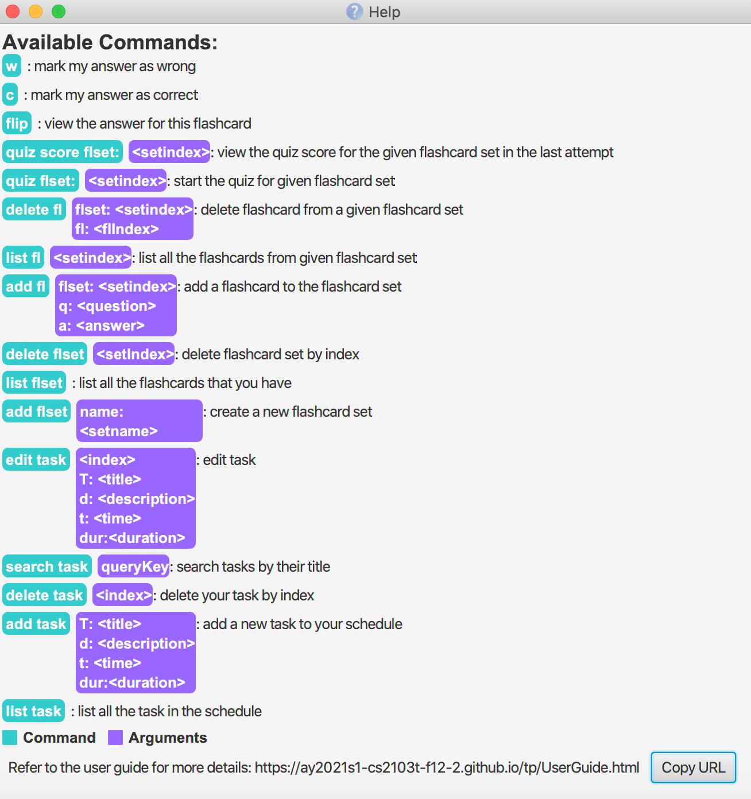

Are you a student of secondary to tertiary education level,
who is a fan of **using flashcards to understand concepts**, 
use your laptop often,
and would like to **schedule your study sessions efficiently**?
If so, we have the product just for you!
 
**StudyBananas** is a desktop study companion app that **helps you centralize your study tasks, 
and caters to your recap needs through flashcard-quizzes**.
It is optimized for use via a Command Line Interface (CLI) while still 
having the benefits of a Graphical User Interface (GUI).
 
This user guide aims to equip you with all necessary understanding to use StudyBananas effectively.

## Table of Contents
- [**Quick start**](#quick-start)
- [**Features**](#features)
  * [Add a flashcard set: `add flset`](#add-a-flashcard-set-add-flset)
  * [List all existing flashcard sets: `list flset`](#list-all-existing-flashcard-sets-list-flset)
  * [Delete a flashcard set: `delete flset`](#delete-a-flashcard-set-delete-flset)
  * [Add a flashcard into a flashcard set: `add fl`](#add-a-flashcard-into-a-flashcard-set-add-fl)
  * [List flashcards in a flashcard set: `list fl`](#list-flashcards-in-a-flashcard-set-list-fl)
  * [Delete a flashcard in a flashcard set: `delete fl`](#delete-a-flashcard-in-a-flashcard-set-delete-fl)
  * [Quiz of flashcard set: `quiz flset`](#quiz-of-flashcard-set-quiz-flset)
  * [View last quiz attempt: `quiz score flset`](#view-last-quiz-attempt-quiz-score-flset)
  * [Add a task: `add task`](#add-a-task)
  * [List tasks: `list task`](#list-tasks)
  * [Delete a task: `delete task`](#delete-a-task)
  * [Search for a task: `search task`](#search-for-a-task)
  * [Saving the data](#saving-the-data)
  * [Viewing help: `help`](#viewing-help-help)
  * [Exit program: `exit`](#exit-program-exit)
- [**FAQ**](#faq)
- [**Command summary**](#command-summary)
  * [General commands](#general-commands)
  * [Flashcard commands](#flashcard-commands)
  * [Quiz commands](#quiz-commands)
  * [Task list commands](#task-list-commands)
  
  
--------------------------------------------------------------------------------------------------------------------

## Quick start

1. Ensure you have Java `11` or above installed in your Computer.

2. Download the latest `study-bananas.jar` from [here](https://github.com/AY2021S1-CS2103T-F12-2/tp/releases).

3. Copy the file to the folder you want to use as the _home folder_ for your StudyBananas.

4. Double-click the file to start the app. The GUI similar to the below should appear in a few seconds. Note how the app contains some sample data. 
   

5. Type the command in the command box and press `Enter` to execute it.
   Some example commands you can try:

   * **`list`**`flset` : Lists all flashcard sets

   * **`add`**`flset name:Chemistry` : Add a new empty set with name `Chemistry`.

   * **`delete`**`flset 3` : Deletes the 3rd flashcard set in the current list of flashcard sets.
   
   * **`add`**`task T:CS2100 d: Pipeline tutorial t:2020-10-10 11:00` : Adds Doing CS2100 task to the task list.

6. Refer to the [Features](#features) below for details of each command.

--------------------------------------------------------------------------------------------------------------------

## Features

**Notes about the command format:** 

* Words wrapped with angled brackets `<>` are compulsory parameters to be supplied by you. 
  e.g. in `add <flset:setname>`, `setname` is a parameter which can be used as `add flset:Chemistry`.

* Words wrapped with square brackets `[]` are optional parameters to be supplied by you. 
  e.g. in `add task <T:title> [d:description]` can be used as `add task T: CS2103T d: Post-lecture quiz` or as `add taskT: CS2103T`. 

* Parameters can be in any order. 
  e.g. if the command specifies `<flset:setindex> <q:question> <a:answer>`, `<a:answer> <q:question> <flset:setindex>` is also acceptable.

&nbsp;

### **Add a flashcard set**: `add flset`

Adds a new flashcard set.

Format: `add flset name:<setname>​`
- `<setname>` can accept names separated with spaces.
- if `<setname>` is already used, the app will request a new `<setname>`.

Examples:
- `add flset name:Japanese`
- `add flset name:Economics – Micro`

&nbsp;

### **List all existing flashcard sets**: `list flset`

Shows all existing flashcard sets - index and name.

Format: `list flset`

&nbsp;

### **Delete a flashcard set**: `delete flset`

Deletes an existing flashcard set and all flashcards that it contains.

Format: `delete flset <setindex>`
- `<setindex>` should be a positive integer.
- `<setindex>` will throw an error if `setindex` does not exist.

Examples:
- `delete flset 1`
- `delete flset 2`

&nbsp;

### **Add a flashcard into a flashcard set**: `add fl`

Adds a single flashcard with a question and an answer in a specified flashcard set.

Format:` add fl flset:<setindex> q:<question> a:<answer>`

- `<question>`, `<answer>` and `<setindex>` fields are compulsory.
- `<question>` and `<answer>` can accept strings that are capitalized or separated with spaces.
- `<setindex>` should be a positive integer.
- `<setindex>` will throw an error if `setindex` does not exist.

Examples:
- `add fl flset:1 q:konnichiwa a:hello `
- `add fl flset:2 q:When demand goes up, what happens to price? a:Price increases`

&nbsp;

### **List flashcards in a flashcard set**: `list fl`

Shows the list of flashcards with details: question, answer and index.

Format: `list fl <setindex>`

- `<setindex>` should be a positive integer.
- `<setindex>` will throw an error if `setindex` does not exist.

Examples:
- `list fl 1`
- `list fl 2`

&nbsp;

### **Delete a flashcard in a flashcard set**: `delete fl`

Deletes a single flashcard in a specified flashcard set.

Format: `delete fl flset:<setindex> fl:<index>`

- `<setindex>` and `<index>` fields are compulsory.
- `<setindex>` and `<index>` should be a positive integer.
- `<setindex>` and `<index>` will throw an error if either does not exist.

Examples:
- `delete fl flset:1 fl:3`

&nbsp;

### **Quiz of flashcard set**: `quiz flset`
Shows the questions of the specific flashcard set. 
Depending on the command you enter, it stores the answers 
and whether they are correct for your reference. 

It is required for you to enter follow-up commands 
to continue with the quiz.

Format: `quiz <flset:setindex>`

Examples: 
`quiz flset:2`, `quiz flset:3`

Alternatively, if you have a quiz task scheduled, 
you may double-click the bright-colored `Quiz:<quizname>` label 
contained in the description of the task as shown below 
(see 3) of [Add a task: `add task`](#add-a-task-add-task))

#### Step 1
When the quiz starts, as seen below, the question 
of the first flashcard within the selected flashcard set appears, 
as well as an Instruction prompt to type in the next command, `flip`, `ans:<answer>`, `refresh` or `cancel`.

- `flip`: Does not store your answer. Displays the answer to the flashcard question.
(You may opt to remember your answer for evaluation against the correct answer later)
- `ans:<answer>`: Stores your answer. Also, displays the answer to the flashcard question.
- `refresh`: Shows the current state of the quiz - Question, Answer and Instruction
(the question, current answer if applicable and prompt instruction)
- `cancel`: Stops the quiz 

#### Step 2
If the command entered is `flip` or `ans:<answer>`, 
the correct answer will be displayed, 
and there will be the Instruction prompt to enter the next command, `c`, `w`, `refresh` or `cancel`.

The image below shows the result when `ans:improves code quality and reduces bugs` is entered:

Based on the correct answer displayed, you may evaluate the answer provided. 
If you think the question is answered correctly, type `c`. 
Else, type `w`. Your response will be taken into account when tabulating the quiz score.

- `c`: Indicates that the question on the flashcard is answered correctly.
- `w`: Indicates that the question is answered wrongly.
- `refresh`: Shows the current state of the quiz - Question, Answer and Instruction
(the question, current answer if applicable and prompt instruction)
- `cancel`: Stops the quiz

#### Step 3
The next question of the next flashcard will be displayed. 
Steps 1-2 are repeated until all flashcards in the set are displayed and answered.

Once the quiz stops, the score statistics will be displayed. 
This score can also be viewed when viewing the last attempt of the flashcard set.
(see [View last quiz attempt: `quiz score flset`](#view-last-quiz-attempt-quiz-score-flset))

&nbsp;

### **View last quiz attempt**: `quiz score flset`
Shows the last attempt of a specific flashcard set.

It contains the following information:
- Score (percentage out of 100%), and
- List of questions each followed by answers from the last attempt
- Indicators of whether the question is answered correctly (shown as tick and cross)

Format: `quiz score <flset:setindex>`

Examples: 
`quiz score flset:9`, `quiz score flset:16`

&nbsp;

### **Add a task**: `add task`

If you would like to add a study task to your schedule, this command allows you to create a task and saves it to the 
schedule, while specifying the `<title>`, `[description]`, `[time]` and `[duration]` of the task.  

After you add a new task to `StudyBananas`, the task information will be saved in the `schedule.json` file.

You can also add a `quiz` as a valid `task` by entering the `quiz flset:<index>` command in the `description` field. 
  
Format: `add task: <T:title> [d:description] [t:time] [dur: duration]`  

Examples:
- `add task T: CS2100 d: Pipeline tutorial dur: 45`
- `add task T: CS2103T d: iP submission t: 2020-09-17 23:59`
- `add Task T: CS2105 d: quiz flset:2 t: Saturday, Oct 31 2020 13:00 dur: 120`

Remarks:
- `title` can accept strings that are capitalized or separated with spaces.
- `time` should be written in the format `t: yyyy-MM-dd HH:mm` or `t: EEEE, MMM-dd-yyyy HH:mm`
- The hours and minutes in `time` is optional. If you do not specify it, the time will be set to 12:00 by default.
- You cannot add a task such that it results in duplicated task, which are tasks having the same title, description, time and 
duration.
- You cannot add a task such that its time range coincides with the time range of existing tasks.

Expected Outcome:

For example, you would like to add a `task` to your schedule with the title **CS2100**, description **Lab 8**, date time 
**2020-10-29 10:00** and duration of **60** minutes.

Entering the command `add task T: CS2100 d: Lab 8 t: 2020-10-29 10:00 dur: 60` while on `Schedule` tab will add the `task` 
to your schedule.

1)Enter the `add task` command, including the specific information of the `task`.
  

 Figure __. Using `add task` command
  
 

2)After using the `add task` command, the new `task` will be added to your schedule and displayed at the end of the 
schedule.
  

Figure __. Result of `add task` command
    
 
&nbsp;

Now, if you would like to add a `quiz` of flashcard set 1 as a `task` to your schedule.

Entering the command `add task T: CS2040S d: quiz flset:1 dur: 30` while on `Schedule` tab will ad the `task` containing
the `quiz` to your schedule.

1)Enter the `add task` command, including the specific information of the `task`.
  

Figure __. Using `add task` command integrate with `quiz`
  
 

2)After using the `add task` command, the new `task` containing the `quiz` will be added to your schedule and displayed at the 
end of the schedule.
  

Figure __. Result of `add task` command integrating with `quiz`
    
 

3)Click on the `Quiz CS2040` box in the `Description` of the task will redirect you to the `quiz` tab and start the `quiz` immediately for you.  
  

Figure __. Result of clicking on the `Quiz CS2040` box
  

&nbsp;

### **View the details of your task**: 
 
There are several panels in our user interface that provides the details of your task. 
- Firstly, the time scale lists out all of your study sessions which are tasks with start time and duration, you can click on your study session on the time scale to view the detail on the top right panel.
- Secondly, the list panel located at the bottom right corner of the schedule tab lists all of your tasks, you can scroll down to view the details of your task or takes advantage of our search feature (please refer to [search task section](#search-for-a-task)) to quickly a specific task.
- In the following user guide, we would time scale to refer to the middle panel of schedule tab, and uses task lists to refer to the bottom right panel.
 

&nbsp;

### **List tasks**: `list task`

If you  would like to view your full `schedule`, this command displays the full `schedule` that you have.  
 
Format: `list task`

Examples:
- `list task`

Expected Outcome:  

1)Enter the command `list task`.
  
  

Figure __. Using `list task` command on `Schedule` tab
    
 

2)After using the `list task` command, you can see the full `schedule`.
  

Figure __. Result of `list task` command
  

&nbsp;

### **Delete a task**: `delete task`

If you complete a task and would like to remove that task from your `schedule`, this command will remove the task
at the specified `index`.  

Upon deletion of the `task`, the saved information of the task will be deleted.  

Format: `delete task <index>`  

Example:
- `delete task 2`  

Remarks:
- The index refers to the index number shown in the fully displayed `schedule`.
- The index must be a positive integer 1, 2, 3, …​ and within range of the task in your `schedule`.  

Expected Outcome:  

For example, you just finished the `task` at index 4, **CS2100 Lab** and you 
would like to delete that `task` from your `schedule`.  

1)Enter the command `delete task 4`.  
  

Figure __. Using `delete task` command
  
 

2)After using the `delete task` command, the specified task is removed from your `schedule`.  
  

Figure __. Result of `delete task` command
  

### **Search for a task**: `search task`

If you would like to search for a specific task using a certain **keyword(s)**, this command displays any `task` that its `title`
contains *any* of the given **keyword(s)** or its `description` and `time` contains *all* of the given **keyword(s)**. 

Format: `search task <keywords>`  

Examples:  
- `search task CS2103T`
- `search task Assignment`
- `search task 2020-10-30`

Remarks:
- The search is case-insensitive. For instance, `homework` matches `Homework`.

Expected Outcome:  

For example, you would like to search for a `task` in the `schedule` with the **keyword** *Lab 8*. StudyBananas 
searches for all tasks containing *Lab 8* in their `title`, `description` and `time` and displays all matching tasks.

1)Enter the command `search task Lab 8` to search for tasks with the **keyword** *Lab 8*.  
  

Figure __. Using `search task` command  

 

2)After using the `search task` command, StudyBananas displays all the tasks with the
specified **keyword**  
  
  

Figure __. Result of `search task` command 

&nbsp;

### **Edit a task**: `edit task`

If you would like to update some task details, this command allows you to edit the details of a trip at a specified `index` in the `schedule`.

You can edit a task's `title`, `description`, `time` and `duration`.  
  
Format: `edit task <index> [T:title] [d:description] [t:time] [dur:duration]`  

Examples:
- `edit task 1 T: Internship`
- `edit task 2 d: Pipleline Tutorial homework dur: 60`
- `edit task 5 6 T: CS2103T d: Post-lecture quiz t: 2020-10-31 13:00 dur: 60`
- `edit task 2 d: Pipleline Tutorial homework dur: 60 d: Assignment Cache`  

Remarks:
- The index refers to the index number shown in the fully displayed `schedule`.
- The index must be a positive integer 1, 2, 3, …​ and within range of the task in your `schedule`. 
- You can key in multiple `<index>`, but only the task at the first `index` will be edited.
- `[title]`, `[description]`, `[time]` and `[duration]` are optional but you need to include at least one of them in the command.
- `[title]`, `[description]`, `[time]` and `[duration]` still need to conform to its respective expected format.  
- You can key in multiple `[title]`, `[description]`, `[time]` and `[duration]`, but only the last information of each field is by the task.  

Expected Outcome:  

For example, you previously add a `task`: *CS2100 Lab 8 on Thursday, Oct 29 2020 10:00 with duration 60 minutes*, which has 
the index of `7` in the `schedule`. Later on, you want to edit the time to 11:00 instead.

1)Enter the command `edit task 7 t: Thursday, Oct 29 2020 11:00` to edit the task.  
  

Figure __. Using `edit task` command 

2)After using the `edit task` command, the details of the `task` are updated accordingly.
  

Figure __. Result of `edit task` command, the task at index `7` is updated 

&nbsp;

### **Saving the data**

StudyBananas data are saved in the hard disk automatically after any command that changes the data. There is no need to save manually.

&nbsp;

### **View help**: `help`
Directs you to this user guide by providing its link.

Format: click on `help` button at the bottom left of the application.
From the window that pops up, copy the link and paste it in your browser:

&nbsp;

### **Exit program**: `exit`
Exits the program.
Format: click on `Exit` button at the bottom left of the application.

&nbsp;

--------------------------------------------------------------------------------------------------------------------

## FAQ

**Q**: How do I transfer my data to another Computer? 
**A**: Install the app in the other computer and overwrite the empty data file it creates with the file that contains the data of your previous StudyBananas home folder.

--------------------------------------------------------------------------------------------------------------------

## Command summary

### General commands

| Action               | Format, Examples |
| -------------------- | ---------------- |
| **Viewing Help**     | `help`           |
| **Exit application** | `exit`           |

&nbsp;

### Flashcard commands

| Action                                 | Format, Examples                                                                                                                         |
| -------------------------------------- | ---------------------------------------------------------------------------------------------------------------------------------------- |
| **Add flashcard set**                  | `add flset:<setname>`   e.g., `add flset:Japanese`                                                                                    |
| **List all flashcard sets**            | `list flset`                                                                                                                          |
| **Delete flashcard set**               | `delete flset:<setindex>`    e.g., `delete flset:1`                                                                                   |
| **Add flashcard in a specified set**   | `add flset:<setindex> q:<question> a:<answer>`   e.g., `add flset:2 q:When demand goes up, what happens to price? a:Price increases.` |
| **List flashcards in a specified set** | `list flset:<setindex>`   e.g., `list fl:1`                                                                                           |
| **Delete flashcard in specified set**  | `delete flset:<setindex> fl:<index>`   e.g., `delete flset:1 fl:1`                                                                    |

&nbsp;

### Quiz commands

| Action                           | Format, Examples                                                                                     |
| -------------------------------- | ---------------------------------------------------------------------------------------------------- |
| **Quiz flset**                   | `quiz <flset:setindex>`   e.g., `quiz flset:7`, `flip`, `ans:<answer>`, `c/w`, `cancel`, `refresh`|
| **Quiz score flset**             | `quiz score <flset:setindex>`    e.g., `quiz score flset:6`                                                  |

&nbsp;

### Task list commands

| Action              | Format, Examples                                                                                                                           |
| ------------------- | ------------------------------------------------------------------------------------------------------------------------------------------ |
| **Add task**        | `add task <T:titile> [d:description] [t:time]`   e.g., `add task T:CS2100 d: Pipeline tutorial`, `add task T:CS2103T d:iP submission t: 2020-09-17 23:59` |
| **List tasks**      | `list task`                                                                                                                             |
| **Delete task**     | `delete task <index>`    e.g., `delete task 6`                                                                                          |
| **Search for task** | `search task <keywords>`   e.g., `search task CS2103T`                                     |
| **Edit task**       | `edit task <index> [T:title] [d:description] [t:time] [dur:duration]`   e.g., `edit task 2 T: CS2103T`, `edit task 1 d: Debug remaining errors dur: 60` |
