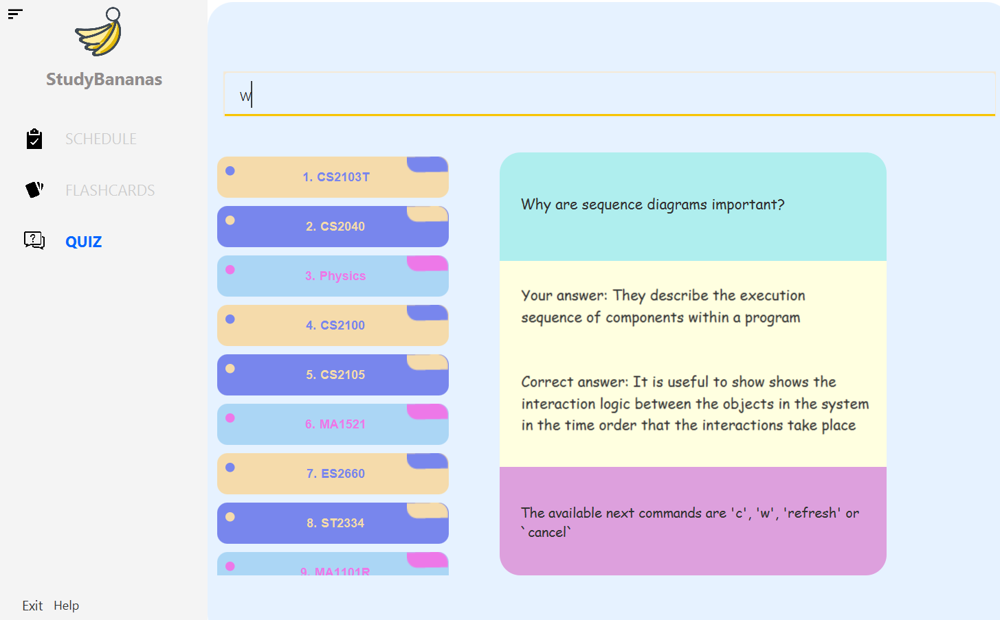
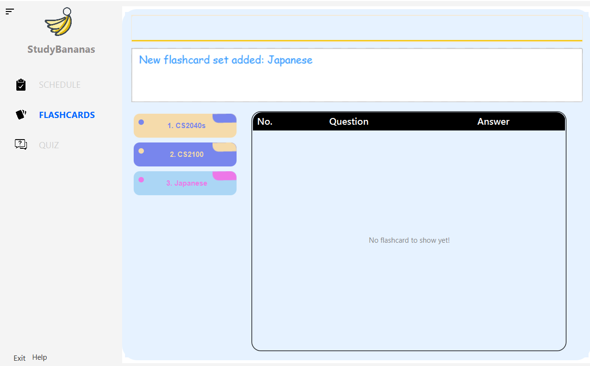
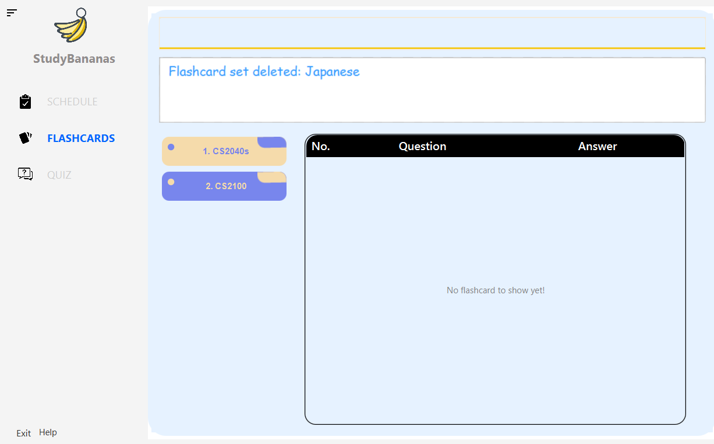
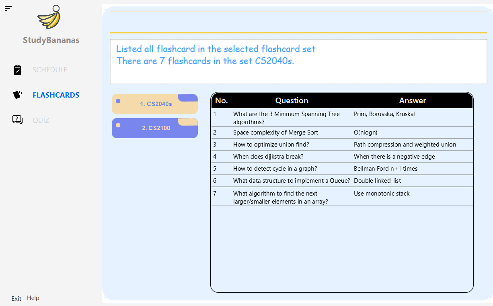
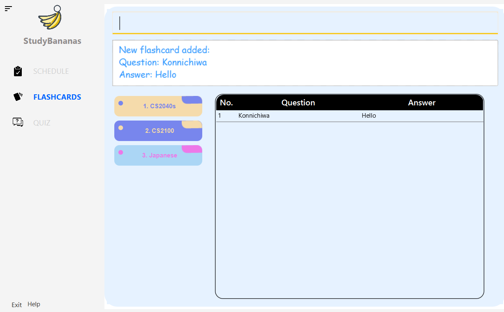
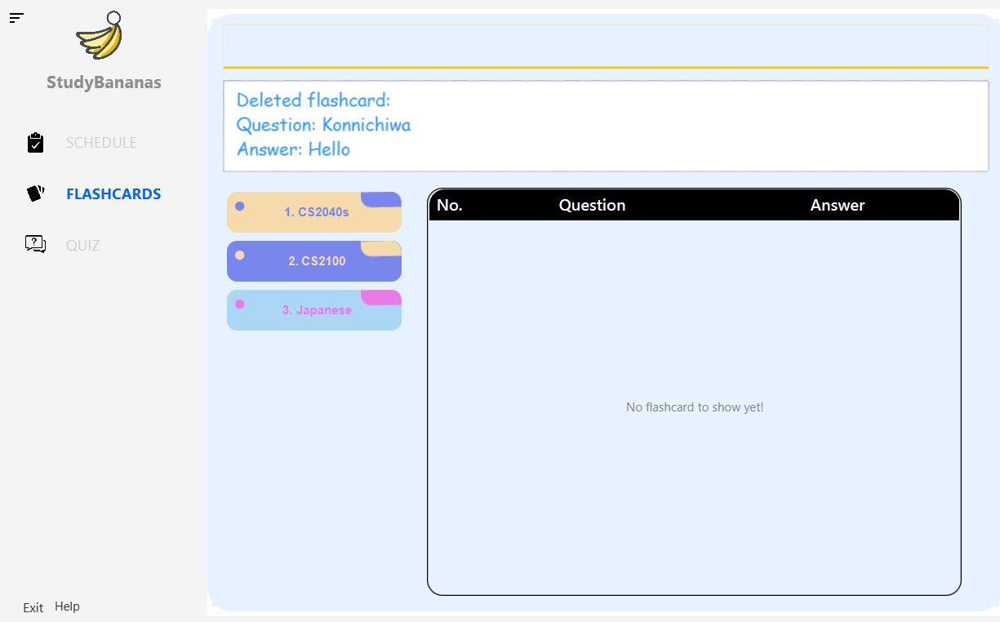

  <h1 align="center">StudyBananas User Guide</h1>
  

    
  

   

  

Welcome to <i>StudyBananas User Guide</i>! Choose a topic from the table of contents below to  find answers, get step-by-step instructions and know us better.
  

  
  <h1>Manage your study plans</h1>
  
Manage all of your study tasks in StudyBananas. Then, start to prepare yourself for the upcoming exams!

  <a href="#31-commands-for-the-schedule-page-binh">How to manage tasks in StudyBananas schedule ></a>

---

  
  

  <h1>Create your own notes with flashcards</h1>
  
Take note with the flashcards, and organize notes using flashcard sets!

  <a href="#32-commands-for-the-flashcard-page-teddy">How to manage flashcards with StudyBananas ></a>
  

---

  
  <h1>Quiz yourself by flashcards</h1>
  
Prepare your exams by quizzing yourself the flashcard notes that you have taken!

  <a href="#33-commands-for-the-quiz-page-bowei">How to start a flashcard quiz ></a>

---

<h1 class="toc_title">Table of Contents</h1>

    <ul class="toc_list">
        <li><a href="#1-introduction-binh">1. Introduction (Binh)</a>
            <ul>
                <li><a href="#11-reading-this-user-guide">1.1 Reading this User Guide</a>
                    <ul>
                        <li><a href="#111-icons-and-meaning">1.1.1 Icons and Meaning</a></li>
                        <li><a href="#112-markdown-notations">1.1.2 Markdown Notations</a></li>
                    </ul>
                </li>
            </ul>
        </li>
        <li><a href="#2-quick-start-eddy">2. Quick start (Eddy)</a></li>
        <li><a href="#3-features">3. Features</a>
            <ul>
                <li><a href="#31-commands-for-the-schedule-page-binh">3.1. Commands for the 
SCHEDULE
 page (Binh)</a>
                     <ul>
                        <li><a href="#311-view-the-details-of-your-task-eddy">3.1.1. <b>3.1.1. View the details of your task</b>:</a></li>
                        <li><a href="#312-add-a-task-add-task">3.1.2. <b>Add a task</b>: 
add task
</a></li>
                        <li><a href="#313-list-all-your-tasks-list-task">3.1.3. <b>List tasks all your tasks</b>: 
list task
</a></li>
                        <li><a href="#314-delete-a-task-delete-task">3.1.4. <b>Delete a task</b>: 
delete task
</a></li>
                        <li><a href="#315-search-for-a-task-search-task">3.1.5. <b>Search for a task</b>: 
search task
</a></li>
                        <li><a href="#316-edit-a-task-edit-task">3.1.6. <b>Edit a task</b>: 
edit task
</a></li>
                    </ul>
                </li>
                <li><a href="#32-commands-for-the-flashcard-page-teddy">3.2. Commands for the 
FLASHCARD
 page (Teddy)</a>
                    <ul>
                        <li><a href="#321-add-a-flashcardset-add-flset">3.2.1. <b>Add a flashcard set</b>: 
add flset
</a></li>
                        <li><a href="#322-delete-a-flashcardset-delete-flset">3.2.2. <b>Delete a flashcard set</b>: 
 delete flset
</a></li>
                        <li><a href="#323-list-flashcards-in-a-flashcardset-list-fl">3.2.3. <b>List flashcards in a
                                    flashcard set</b>: 
list fl
</a></li>
                        <li><a href="#324-add-a-flashcard-into-a-flashcardset-add-fl">3.2.4. <b>Add a flashcard into a
                                flashcard set</b>: 
add fl
</a></li>
                        <li><a href="#325-delete-a-flashcard-in-a-flashcardset-delete-fl">3.2.5. <b>Delete a flashcard
                                in a flashcard set</b>: 
delete fl
</a></li>
                    </ul>
                </li>
                <li><a href="#33-commands-for-the-quiz-page-bowei">3.3. Commands for the 
QUIZ
 page (Bowei)</a>
                    <ul>
                        <li><a href="#331-quiz-of-a-flashcardset-quiz-flset">3.3.1. <b>
QUIZ
 of flashcard set</b>: 
quiz
                                flset
</a></li>
                        <li><a href="#322-view-last-quiz-attempt-quiz-score-flset">3.3.2. <b>View last 
QUIZ
 attempt</b>:
                                
quiz score flset
</a></li>
                    </ul>
                </li>
                <li><a href="#34-general-commands-binh">3.4. General Commands (Binh)</a>
                    <ul>
                        <li><a href="#341-view-all-the-available-commands-help">3.4.1. <b>View all the available
                                commands</b>: 
help
</a></li>
                        <li><a href="#342-exit-program-exit">3.4.2. <b>Exit program</b>: 
exit
</a></li>
                    </ul>
                </li>
                <li><a href="#saving-the-data"><b>Saving the data</b></a></li>
            </ul>
        </li>
        <li><a href="#faq-teddy">4. FAQ (Teddy)</a></li>
        <li><a href="#trouble-shooting-eddy">5. Trouble Shooting</a>
            <ul>
                 <li><a href="#cannot-launch-the-application">5.1. Cannot launch the application</a>
                    <ul>
                         <li><a href="#windows">5.1.1. Windows</a></li>
                         <li><a href="#mac">5.1.2. Mac</a></li>
                         <li><a href="#linux">5.1.3. linux</a></li>
                    </ul>
                 </li>
                 <li><a href="#cannot-find-my-data-locally">5.2. Cannot find my data locally</a></li>
                  <li><a href="#my-data-is-gone-after-i-manipulate-the-data-in-the-data-folder-directly">5.3. My data is gone after I manipulate the data in the data folder directly</a></li>
             </ul>
        </li>
        <li><a href="#community-and-security">6. Community and Security</a>
            <ul>
                <li><a href="#user-data">6.1. User Data</a></li>
                <li><a href="#study-community">6.2. Study Community</a></li>
            </ul>
        </li>
         <li><a href="#bug-report">7. Bug report</a></li>
        <li><a href="#command-summary">8. Command summary</a>
            <ul>
                <li><a href="#schedule-commands-binh">8.1. Task list commands (Binh)</a></li>
                <li><a href="#flashcard-commands-teddy">8.2. Flashcard commands (Teddy)</a></li>
                <li><a href="#quiz-commands-bowei">8.3. Quiz commands (Bowei)</a></li>
                <li><a href="#general-commands">8.4. General commands</a></li>
            </ul>
        </li>
    </ul>

The above part is managed by Eddy.

# **1. Introduction** (Binh)

Are you a student of secondary to tertiary education level,
who is a fan of **using flashcards to understand concepts**,
use your laptop often,
and would like to **schedule your study sessions efficiently**?
If so, we have the product just for you!

**StudyBananas** is a desktop study companion app that **helps you centralize your study tasks,
and caters to your recap needs through flashcard-quizzes**.
It is optimized for use via a Command Line Interface (CLI) while still
having the benefits of a Graphical User Interface (GUI).

This user guide aims to equip you with all necessary understanding to use StudyBananas effectively.

## 1.1 Reading this User Guide

Before you begin, here are some important notations that you should be aware of
when reading this user guide.

### 1.1.1 Icons and Meaning

|                      Icon                       | Meaning                                                                                                                                                                                                        |
| :---------------------------------------------: | -------------------------------------------------------------------------------------------------------------------------------------------------------------------------------------------------------------- |
|              | Tips are just for your information. They can help you use StudyBananas more efficiently.                                                                                                                       |
|            | A note informs you of specific conditions or behaviours of a feature.                                                                                                                                          |
|  | Warnings denote extremely important details to take note of. These include irreversible actions, and important instructions that when not followed, may cause StudyBananas to crash or corrupt its data files. |

Table 1. Icons in this User Guide

### 1.1.2 Markdown notations

|                    Markdown                             | Meaning                                                                 |
| :-----------------------------------------------------: | ----------------------------------------------------------------------- |
|           `add flset <name:setname>​`                | Commands and terminology that can be used in StudyBananas command line. |
|        `index`, `name`, `title`, `time`                 | Various arguments that you can include in the command.                  |
| `QUIZ`, `SCHEDULE`, `FLASHCARD`, `FLASHCARDSET`, `TASK` | Various features that StudyBananas offers.                              |

Table 2. Markdown notations in this User Guide

---

# 2. Quick start (Eddy)

1. Ensure you have Java `11` or above installed in your Computer.

2. Download the latest `StudyBananas.jar` from [here](https://github.com/AY2021S1-CS2103T-F12-2/tp/releases).

3. Copy the file to the folder you want to use as the _home folder_ for your StudyBananas.

4. Double-click the file to start the app. The GUI similar to the below should appear in a few seconds. Note how the app contains some sample data. 
   

5. Type the command in the command box and press `Enter` to execute it.
   Some example commands you can try:

   - **`list`** `task` : Lists all `TASK`s

   * **`add`** `flset name:Chemistry` : Add a new empty `FLASHCARDSET` with name `Chemistry`.

   * **`delete`** `flset 3` : Deletes the 3rd `FLASHCARDSET` in the current list of `FLASHCARDSET`s.

   * **`add`** `fl flset:3 q:What is the chemical formula of water? a:H2O` : Add a flashcard to the 3rd `FLASHCARDSET`.

   * **`add`** `task T:CS2100 d: Pipeline tutorial t:2020-10-10 11:00` : Adds Doing CS2100 `TASK` to the `SCHEDULE`.

6. Refer to the [Features](#3-features) below for details of each command.

---

# 3. Features

**Notes about the command format:** (Binh)
 

- Words wrapped with angled brackets `<>` are compulsory parameters or prefix-parameter pairs to be supplied by you. 
  e.g. In `add <flset:setname>`, `flset:` is the prefix and `setname` is the parameter, which can be used as `add flset:Chemistry`.

- Words wrapped with square brackets `[]` are optional parameters or prefix-parameter pairs to be supplied by you. 
  e.g. In `add task <T:title> [d:description]`, `d:` is the prefix while `description` is the parameter. The command can be used as `add task T: CS2103T d: Post-lecture quiz` or as `add task T: CS2103T`.

- Prefix-parameter pairs can be in any order. 
  e.g. If the command specifies `<flset:setindex> <q:question> <a:answer>`, `<a:answer> <q:question> <flset:setindex>` is also acceptable.

- The same prefix-parameter pair can be used in a same command, however only the value of the last pair is used.  
  e.g. In `add task T: CS2103T d: Tutorial Week 2 T: CS2100`, there are 2 parameters with the prefix `T:` but only the last one `CS2100` is taken as the input value.

&nbsp;

## 3.1. Commands for the `SCHEDULE` page (Binh)

### 3.1.1. **View the details of your `TASK`**: (Eddy)

There are several panels in our user interface that provides the details of your `TASK`.

- Firstly, the time scale lists out all of your study sessions, which are `TASK`s, with start time and duration. You can click on your study session on the time scale to view the details on the top right panel.
- Secondly, the list panel located in the bottom right corner of the `SCHEDULE` tab lists all of your tasks, you can scroll down to view the details of your `TASK`s, or take advantage of the search feature to quickly find a specific task (refer to [search task section](#315-search-for-a-task-search-task)).
- In the following user guide, we use time scale to refer to the middle panel of `SCHEDULE` tab, and uses `TASK` lists to refer to the bottom right panel.

Figure 3.1.1: Annotated view of the Task Detail Panel
    
 

&nbsp;

### 3.1.2. **Add a `TASK`**: `add task`

If you would like to add a study `TASK` to your `SCHEDULE`, this command allows you to create a `TASK` and saves it to the
`SCHEDULE`, while specifying the `title`, `description`, `time` and `duration` of the task.

After you add a new `TASK` to StudyBananas, the `TASK`'s information is saved in the `schedule.json` file.

You can also add a `QUIZ` as a valid `TASK` by entering the `quiz <flset:setindex>` command in the `description` field.

| Format                                | `add task <T:title> [d:description] [t:time] [dur: duration]`                                                                                                                                                                                                                                                                                                                                                                                                                                                                                                                                                                                                                                                                                                                                                                              |
| ------------------------------------- | :----------------------------------------------------------------------------------------------------------------------------------------------------------------------------------------------------------------------------------------------------------------------------------------------------------------------------------------------------------------------------------------------------------------------------------------------------------------------------------------------------------------------------------------------------------------------------------------------------------------------------------------------------------------------------------------------------------------------------------------------------------------------------------------------------------------------------------------- |
| Example                               | `add task T: CS2100 d: Pipeline tutorial dur: 45`   `add task T: CS2103T d: iP submission t: 2020-09-17 23:59`   `add task T: CS2105 d: quiz flset:2 t: Saturday, Oct 31 2020 13:00 dur: 120`                                                                                                                                                                                                                                                                                                                                                                                                                                                                                                                                                                                                                                        |
|  | • `title` and `description` can accept strings that are capitalized or separated with spaces.   • The hours and minutes in `time` are optional. If you do not specify it, StudyBananas will set the time to 12:00 by default.   • `time` should be written in one of the following formats:   • `yyyy-MM-dd [HH:mm]` (24-hour format, e.g. 23:00)  • `EEEE, [MMM-dd-yyyy] [HH:mm]` (24-hour format, e.g. 23:00)  • `duration` has to be a positive integer in minute and its value has to be less than _1440_ (number of minutes in a day).  • You cannot add a `TASK` such that it results in a duplicated `TASK`, which are `TASK`s having the same title, description, time and duration.   • You cannot add a `TASK` such that its time range overlaps with the time range of existing `TASK`s in the `SCHEDULE`. |

 

#### 3.1.2.1. Adding a normal `TASK`

For example, you would like to add a `TASK` to your `SCHEDULE` with the `title` _CS2100_, `description` _Lab 8_, `time`
_2020-10-29 10:00_ and `duration` of _60_ minutes.

Entering the command `add task T: CS2100 d: Lab 8 t: 2020-10-29 10:00 dur: 60` while on `SCHEDULE` page will add the `TASK`
to your `SCHEDULE`.

1\. Enter the `add task` command, including the specific information of the `TASK`.

Figure 3.1.2.1a: Using <code>add task</code> command
  
 

2\. After using the `add task` command, the new `TASK` will be added to the end of your `SCHEDULE` by default.

Figure 3.1.2.1b: Result of <code>add task</code> command
    
 
&nbsp;

#### 3.1.2.2. Adding a `QUIZ` `TASK`

Now, if you would like to add a `QUIZ` of `FLASHCARDSET` 1 as a `TASK` to your `SCHEDULE`.

Entering the command `add task T: CS2040S d: quiz flset:1 dur: 30` while on `SCHEDULE` tab will add the `TASK` containing
the `QUIZ` to your schedule.

1\. Enter the `add task` command, including the specific information of the `TASK`.

Figure 3.1.2.2a: Using <code>add task</code> command integrate with <code>QUIZ</code>
  
 

2\. After using the `add task` command, the new `TASK` of doing the `QUIZ` will be added to the end of your `SCHEDULE`.

Figure 3.1.2.2b: Result of <code>add task</code> command integrating with <code>QUIZ</code>
    
 

3\. Click on the highlighted `Quiz CS2040` box in the `description` of the `TASK` will redirect you to the `QUIZ` tab and start the `QUIZ` immediately for you.  

Figure 3.1.2.2c: Result of clicking on the <code>Quiz CS2040</code> box

&nbsp;

### 3.1.3. **List all your `TASK`s**: `list task`

If you would like to view your full `SCHEDULE`, this command displays the full `SCHEDULE` that you are having at the moment.

| Format  | `list task` |
| ------- | :---------- |
| Example | `list task` |

 

**Expected Outcome**:

1\. Enter the command `list task`.

Figure 3.1.3a: Using <code>list task</code> command on <code>SCHEDULE</code> tab
    
 

2\. After using the `list task` command, you can see the full `SCHEDULE`.

Figure 3.1.3b: Result of <code>list task</code> command

&nbsp;

### 3.1.4. **Delete a `TASK`**: `delete task`

If you complete a `TASK` and would like to remove that specific `TASK` from your `SCHEDULE`, this command helps you remove the task at the specified `index`.

Upon deletion of the `TASK`, the saved information of the `TASK` in `schedule.json` file will be deleted as well.

| Format                                          | `delete task <index>`                                                                                                                                                                                                                                                       |
| ----------------------------------------------- | :-------------------------------------------------------------------------------------------------------------------------------------------------------------------------------------------------------------------------------------------------------------------------- |
| Example                                         | `delete task 2`                                                                                                                                                                                                                                                             |
|            | • The `index` refers to the index number shown in the fully displayed `SCHEDULE` after you [list task](#313-list-all-your-tasks-list-task)   • The index must be a positive integer 1, 2, 3, …​ and within range of the number of `TASK` you have in your `SCHEDULE`. |
|  | • This action is irreversible. Once you delete a specific `TASK`, the `TASK` and its respective information are removed from the storage file as well.                                                                                                                      |

 

**Expected Outcome**:

For example, you just finished the `TASK` at `index` 4 in the `SCHEDULE`, _CS2100 Lab_ and you
would like to update your `SCHEDULE` by deleting that `TASK`.

1\. Find the `index` of the `TASK` to be deleted with the [list task](#313-list-all-your-tasks-list-task) command.

2\. From the figure below, you can identify the `TASK` to be deleted has an `index` of 4, enter the command `delete task 4`.  

Figure 3.1.4a: Using <code>delete task</code> command
  
 

3\. After using the `delete task` command, the specified `TASK` is removed from your `SCHEDULE`.  

Figure 3.1.4b: Result of <code>delete task</code> command

 

### 3.1.5. **Search for a `TASK`**: `search task`

If you have trouble finding certain specific `TASK`s, you can search for them using a certain **keyword(s)**, this command displays any `TASK` that its `title`
contains _any_ of the given **keyword(s)** or its `description` and `time` contains _all_ of the given **keyword(s)**.

| Format                                | `search task <keywords>`                                                                                                                                                                                                                        |
| ------------------------------------- | :---------------------------------------------------------------------------------------------------------------------------------------------------------------------------------------------------------------------------------------------- |
| Example                               | `search task CS2103T PE`   `search task Normal distribution assignment`   `search task 2020-11-10`                                                                                                                                        |
|  | • The search **keyword(s)** is case-insensitive. For instance, `homework` matches `HomeWork`.   • The search requires a complete match of the **keyword**. For instance, `CS2103` does not match `CS2103T` as they are not a complete match. |

 

**Expected Outcome**:

For example, you would like to search for a `TASK` in the `SCHEDULE` with the **keyword** _Lab 8_. StudyBananas
searches for all `TASK`s containing _Lab 8_ in their `title`, `description` and `time` and displays all matching tasks.

1\. Enter the command `search task Lab 8` to search for `TASK`s with the **keyword** _Lab 8_.
  

Figure 3.1.5a: Using <code>search task</code> command  

 

2\. After using the `search task` command, StudyBananas displays all the `TASK`s with the
specified **keyword**.  

Figure 3.1.5b: Result of <code>search task</code> command 

&nbsp;

### 3.1.6. Edit a `TASK`: `edit task`

If you would like to update certain details of a specific `TASK`, this command allows you to edit the details of a `TASK` at a specified `index` in the `SCHEDULE`.

You can edit a `TASK`'s `title`, `description`, `time` and `duration`.

| Format                                          | `edit task <index> [T:title] [d:description] [t:time] [dur:duration]`                                                                                                                                                                                                                                                                                                                                                                                                                                                                    |
| ----------------------------------------------- | :--------------------------------------------------------------------------------------------------------------------------------------------------------------------------------------------------------------------------------------------------------------------------------------------------------------------------------------------------------------------------------------------------------------------------------------------------------------------------------------------------------------------------------------- |
| Example                                         | `edit task 1 T: Internship`   `edit task 2 d: Pipleline Tutorial homework dur: 60`   `edit task 2 d: Pipleline Tutorial homework dur: 60`                                                                                                                                                                                                                                                                                                                                                                                          |
|            | • The `index` refers to the index number shown in the fully displayed `SCHEDULE` after you [list task](#313-list-all-your-tasks-list-task)   • The index must be a positive integer 1, 2, 3, …​ and within range of the number of `TASK` you have in your `SCHEDULE`.   • `[title]`, `[description]`, `[time]` and `[duration]` are optional but you need to include at least one of them in the command.   • `[title]`, `[description]`, `[time]` and `[duration]` still need to conform to its respective expected format. |
|  | • This action is irreversible. Once you edit a specific `TASK`, the `TASK`'s details are modified in the storage file as well.                                                                                                                                                                                                                                                                                                                                                                                                           |

 

**Expected Outcome**:

For example, you previously added a `TASK`: _CS2100 Lab 8 on Thursday, Oct 29 2020 10:00 with duration 60 minutes_, which currently has
the index of `7` in the `SCHEDULE`. Later on, you want to edit the `time` to 11:00 instead.

1\. Enter the command `edit task 7 t: Thursday, Oct 29 2020 11:00` to edit the `TASK`.  

Figure 3.1.6a: Using <code>edit task</code> command 

 

2\. After using the `edit task` command, the details of the `TASK` are updated accordingly.

Figure 3.1.6b: Result of <code>edit task</code> command, the `TASK` at `index` 7 is updated 

&nbsp;

## 3.2. Commands for the `FLASHCARD` page (Teddy)

### 3.2.1. **Add a `FLASHCARDSET`**: `add flset`

If you would like to create a new `FLASHCARDSET`, this commands allows you to create a new `FLASHCARDSET` with a custom name to store and categorize your `FLASHCARD`s.

| Format                                | **`add flset <name:setname>`**                                         |
| ------------------------------------- | ---------------------------------------------------------------------- |
| Example                               | `add flset name:Japanese`                                              |
|  | The parameter `setname` must not be an existing `FLASHCARDSET` name.   |

 

**Expected Outcome:**

Figure 3.2.1: Result of <code>add flset name:Japanese</code> command

&nbsp;

### 3.2.2. **Delete a `FLASHCARDSET`**: `delete flset`

If you would like to delete an existing `FLASHCARDSET`, this commands allows you to delete using the index of the `FLASHCARDSET`.

| Format                                           | **`delete flset <setindex>`**                                                                                                                               |
| ------------------------------------------------ | ----------------------------------------------------------------------------------------------------------------------------------------------------------- |
| Example                                          | `delete flset 3`                                                                                                                                            |
|             | This deletes all the `FLASHCARD`s in the `FLASHCARDSET`, including its last `QUIZ` attempt.                                                                 |
|   | This action is irreversible. Once you delete a `FLASHCARDSET`, the `FLASHCARDSET` and its respective information are removed from the storage file as well. |

 

**Expected Outcome:**

Figure 3.2.2: Result of <code>delete flset 3</code> command

&nbsp;

### 3.2.3. **List `FLASHCARD`s in a `FLASHCARDSET`**: `list fl`

This command allows you to view the detailed list of `FLASHCARD` in a specified `FLASHCARDSET` using its index.

| Format                                | **`list fl <setindex>`**                                                                |
| ------------------------------------- | --------------------------------------------------------------------------------------- |
| Example                               | `list fl 1`                                                                             |
|    | Alternatively, you can click on the `FLASHCARDSET` in the GUI to view its `FLASHCARD`s. |

 

**Expected Outcome:**

Figure 3.2.3: Result of <code>list fl 1</code> command

&nbsp;

### 3.2.4. **Add a `FLASHCARD` into a `FLASHCARDSET`**: `add fl`

This command allows you to add a single `FLASHCARD` consisting of a question and an answer, in a specified `FLASHCARDSET` using its index.

| Format         | **`add fl <flset:setindex> <q:question> <a:answer>`** |
| -------------- | ----------------------------------------------------- |
| Example        | `add fl flset:3 q:Konnichiwa a:Hello`                 |

 

**Expected Outcome:**

Figure 3.2.4: Result of <code>add fl flset:3 q:Konnichiwa a:Hello</code> command

&nbsp;

### 3.2.5. **Delete a `FLASHCARD` in a `FLASHCARDSET`**: `delete fl`

This command allows you to delete a single `FLASHCARD` in a specified `FLASHCARDSET` using their indexes.

| Format                                           | **`delete fl <flset:setindex> <fl:index>`**                                                                                                                                                                         |
| ------------------------------------------------ | ----------------------------------------------------------------------------------------------------------------------------------------------------- |
| Example                                          | `delete fl flset:3 fl:1`                                                                                                                              |
| Remark on Example                                | Deletes the 1st `FLASHCARD` in the 3rd `FLASHCARDSET`                                                                                                 |
|   | This action is irreversible. Once you delete a `FLASHCARD`, the `FLASHCARD` and its respective information are removed from the storage file as well. |

 

**Expected Outcome:**

Figure 3.2.5: Result of <code>delete fl flset:3 fl:1</code> command

&nbsp;

## 3.3. Commands for the `QUIZ` page (Bowei)

### 3.3.1. **`QUIZ` of a `FLASHCARDSET`**: `quiz flset`

Already have some `FLASHCARD`s and would like to start a recap session? 
This command helps you start a `QUIZ` with a non-empty `FLASHCARDSET` of your choice.

There are two ways to launch a `QUIZ` in StudyBananas. 
You may do so by either:
* **Entering commands into the command box:**

| Accepted Formats            | **`quiz <flset:setindex>`**  | **`quiz <flset:setname>`**  |
| --------------------------- | ---------------------------- | --------------------------- |
| Examples                    | `quiz flset:1`               | `quiz flset:CS2103T`        |

* **Or, through clicking on a scheduled `QUIZ` in the `SCHEDULE`:** 
If you have a `QUIZ` scheduled (see [Adding a `QUIZ` task](#3122-adding-a-quiz-task)), 
you may click on the highlighted `QUIZ` label contained in the description of the `TASK` as shown below.

**Note: When the `QUIZ` has started, the system is in quiz-mode. You are required to enter follow-up commands to continue with the `QUIZ`.**

|                             | Only general and quiz-mode commands are allowed at designated times, as stated below. |
| ---------------------------------------------------------------- | ------------------------------------------------------------------------------------- |
| At all times in quiz-mode                                        | `exit`, `help`, `cancel`, `refresh`                                                   |
| Only the question is shown (see **3.2.1.2.**)                    | `flip`, `<ans:answer>`                                                                |
| Both the question and correct answer is shown (see **3.3.1.3.**) | `c`, `w`                                                                              |

You may find more information on the respective quiz-mode commands by referring to the steps and descriptions below.

| Format    | Usages of all-time-available quiz-mode commands                                                                                                                                         |
| --------- | --------------------------------------------------------------------------------------------------------------------------------------------------------------------------------------- |
| `refresh` | Shows the current state of the quiz - the question, current answer (if applicable) and prompt instruction, in case you wish to continue with the quiz after entering an invalid command |
| `cancel`  | Stops the quiz. Your quiz records will not be stored upon quiz cancellation.                                                                                                            |

 

#### 3.3.1.1. **Getting the question**
When the `QUIZ` launches, as seen below, you will see the question
of the first `FLASHCARD` within the selected `FLASHCARDSET`,
as well as an instruction prompt to type in the next available commands,
`flip`, `<ans:answer>`, `refresh` or `cancel`.

**Expected Outcome:**

Figure 3.3.2.1: Result of <code> quiz flset:CS2103T</code> command

 

#### 3.3.1.2. **Answering the question**
If you would like to see your answer directly, enter `flip`. 
However, if you would like StudyBananas to store your answer for later reference,
enter your answer with `<ans:answer>`.

| Format         | Remarks                                                                                                                                                                 |
| -------------- | ----------------------------------------------------------------------------------------------------------------------------------------------------------------------- |
| `flip`         | Does not store your answer. Displays the answer to the `FLASHCARD` question.   (You may opt to remember your answer for evaluation against the correct answer later) |
| `<ans:answer>` | Stores your answer. Also, displays the answer to the `FLASHCARD` question.                                                                                              |

If the command entered is `flip` or `<ans:answer>`,
the correct answer will be displayed,
and you will be prompted to enter the next available commands, `c`, `w`, `refresh` or `cancel`,
as shown below.

**Expected Outcome:**

Figure 3.3.2.2: Result of <code>ans:improves code quality and reduces bugs</code> command

 

#### 3.3.1.3. **Checking if your answer is correct**
Based on the correct answer, you may evaluate your own answer.
Your response will be taken into account when tabulating the `QUIZ` score.

| Format | Command usages                                                          |
| ------ | ----------------------------------------------------------------------- |
| `c`    | Indicates that the question of the `FLASHCARD` is answered _correctly_. |
| `w`    | Indicates that the question of the `FLASHCARD` is answered _wrongly_.   |

The question of the next `FLASHCARD` will be displayed.

 

#### 3.3.1.4. **Continuing the `QUIZ` cycle**
Steps 1-3 are repeated until all `FLASHCARD`s in the `FLASHCARDSET` are displayed and answered.

Once the quiz stops, the score statistics will be displayed.
This score can also be viewed when viewing the last attempt of the `FLASHCARDSET`.
(see [View last quiz attempt: `quiz score flset`](#322-view-last-quiz-attempt-quiz-score-flset))

&nbsp;

### 3.2.2. **View last `QUIZ` attempt**: `quiz score flset`

Shows the last attempt of a `QUIZ` on a specified `FLASHCARDSET`.

| Accepted Formats            | **`quiz score <flset:setindex>`**  | **`quiz score <flset:setname>`**  |
| --------------------------- | ---------------------------------- | --------------------------------- |
| Examples                    | `quiz score flset:5`               | `quiz score flset:CS2040`         |

The last `QUIZ` attempt contains the following information:

- Score (percentage out of 100%), and
- List of questions each followed by answers from the last attempt
- Indicators of whether the question is answered correctly (shown as tick and cross)

 

**Expected outcome**:

Figure 3.2.2: Result of <code>quiz score flset:CS2103T</code> command

&nbsp;

## 3.4. General Commands (Binh)

### 3.4.1. **View all the available commands**: `help`

If you are not sure of how a certain command works or what command would suit your needs, you can open the help window with this command to view all the available commands.

| Format                              | `help`                                                                                                          |
| ----------------------------------- | --------------------------------------------------------------------------------------------------------------- |
|  | Alternatively, you can click on the `help` button located at the bottom of the sidebar to open the help window. |

Figure 3.4.1a: <code>help</code> button as shown

 

**Expected Outcome:**

The `help` window shows most of the available CLI commands.

- The cyan label is the name of the command
- The purple label lists all the arguments that you may enter.

Figure 3.4.1b: <code>help</code> window as shown

&nbsp;

### 3.4.2. **Exit program**: `exit`

If you would like to close the application, this command helps you to quickly close StudyBananas.

| Format                              | `exit`                                                                                                          |
| ----------------------------------- | --------------------------------------------------------------------------------------------------------------- |
|  | Alternatively, you can click on the `exit` button located at the bottom of the sidebar to open the help window. |

Figure 3.4.2: <code>exit</code> button as shown

&nbsp;

## **Saving the data**

StudyBananas saves data in the hard disk automatically after any command that changes the data. There is no need to save manually.

&nbsp;

---

# FAQ (Teddy)

**Q: Is StudyBananas free?** 
**A**: Yes, StudyBananas is absolutely free to use!

**Q: I have StudyBananas.jar downloaded but cannot start the application. Is there anything I can do?** 
**A**: Yes, open the command prompt on your computer, navigate to the directory in which you have stored studybananas.jar and type java -jar studybananas.jar.

**Q: Is StudyBananas safe to use?** 
**A**: Yes, StudyBananas is safe to use! We regularly review our code to ensure that hackers are unable to exploit the security structure of our software.

**Q: Is my data secure?** 
**A**: Yes, your data is safe! It is stored only on your device, and not sent to any online servers. There is also no need to register to start using StudyBananas.

**Q: Do I need an Internet connection to use StudyBananas?** 
**A**: No, you don’t! StudyBananas works 100% offline. This is especially useful when you want to focus on your studying and not get distracted by social media.

**Q: Will StudyBananas be consistently be updated?** 
**A**: Yes! We are a dedicated team of software developers who constantly collate feedback and run tests on the StudyBananas app. We are also looking forward to delivering more features for our users.

**Q: Can I use StudyBananas on a mobile device?** 
**A**: StudyBananas is designed to work best on a desktop/laptop.

**Q: How do I transfer my data to another Computer?** 
**A**: Install the app in the other computer and overwrite the empty data file it creates with the file that contains the data of your previous StudyBananas home folder.

&nbsp;

---
# Trouble Shooting (Eddy)

## Cannot launch the application

- Check if you have Java `11` or above installed in your Computer. 

### Windows

1.  Open command prompt and type java -version. 

    - If you get the version info, Java is installed correctly and PATH is also set correctly. You can skip the rest.
    

2. Go to start menu -> System -> Advanced -> Environment Variables. Set JAVA_HOME to the path of your JDK, and update the system path. For more details, please refer to this <a href="https://javatutorial.net/set-java-home-windows-10">website</a> 

3.  If none of the above work, try to search you file system for javac.exe. If there is no javac.exe, download JDK from <a href="https://www.oracle.com/java/technologies/javase-jdk11-downloads.html">Oracle Website for JDK</a> and install.

### Mac

1. Open terminal and type java -version.

    - If you get the version info and have made sure that the version 11 or above, your Java is installed correctly. You can skip the rest.
    
2. Go to the <a href="https://www.oracle.com/java/technologies/javase-jdk11-downloads.html">the Oracle Website for JDK</a> and download the macOS version JDK and install.
 
### Linux

1. Open up your terminal, and type `find / -name "java"`

2. If the path for jdk is shown after the command, type` export JAVA_HOME=/path/to/java/jdk1.x`, otherwise Go to the <a href="https://www.oracle.com/java/technologies/javase-jdk11-downloads.html">the Oracle Website for JDK</a> and download the Lunix version JDK and install.

## Cannot find my data locally

Your schedule, flashcard, and quiz history data will be stored inside the folder named **data** which would reside in the folder where you put your StudyBananas.jar.

If you still cannot find any default data, make sure you have enter at lease one command in the command box after your first launch, the default data would only be stored after the first command is executed.

## My data is gone after I manipulate the data in the data folder directly

The data is stored in the format of JSON for StudyBananas. Our development team does not recommend modifying data from the data folder directly, but 
if after your edit, the data is not shown in your application, it is likely that the format of JSON file is wrong. Please open your storage file in
text editors that support JSON file static check e.g. Visual Studio, Intellij... and modify your file into valid JSON format with the help of the text editor. 
After your edit, place the file with correct JSON format back to the **data** folder and make sure the file name is the same as it was. Then, relaunch StudyBananas, you should 
be able to see the updated data.

|                                      |                                                                                                                                                                                                                                                  |
| ----------------------------------------------- | :-------------------------------------------------------------------------------------------------------------------------------------------------------------------------------------------------------------------------------------------------------------------------- |
|                                          | Note that: our application reads the storage files by its **path**, please make sure the storage files are named as **flashcardbank.json**, **quizrecords.json** and **schedule.json**                                                                                                                                                                                                                                                         |

---

# Community and security (Eddy)

## User data

StudyBananas is designed to be a self-study tool and not an online study community.

We do not store your data through any cloud database. All your schedules and notes are 
only collected and manipulated under your local folder which is named **data** by our 
development team. Therefore, the physical integrity of the your data is secured within 
StudyBananas. 

## Study community

Current version of StudyBananas - 1.4 does not support any functionality required 
internet connection.

Many feedbacks that we have received request for functionality of sharing data in 
a user's study community. Therefore, our team decides to build a cloud community in 
the version 2.0 release of StudyBananas, and plans to build the sharing functionality
as well as other community related functionality afterwards. But take note that our 
team still believes internet-connection can be a huge distraction for studying, the 
upcoming cloud community will not support chat room or other social media like features.
StudyBananas will still be optimized without internet connection.

---

# Bug report (Eddy)

Version 1.4 StudyBananas is still under testing phase. Version 1.4 release would serve
as the public beta testing for StudyBananas. We have done comprehensive amount of unit tests 
and integration tests on the application, and have put StudyBananas under preliminary alpha 
testing by some students in NUS SoC. There can still be some unnoticed bugs. If you have spot
any bugs or have any suggestions on the application, please go to 
<a href="https://github.com/AY2021S1-CS2103T-F12-2/tp/issues">our github issue page</a> to 
issue the bugs and the suggestions. Great appreciation from the development team of StudyBananas.

# Command summary

## `SCHEDULE` commands (Binh)

| Action                  | Format, Examples                                                                                                                 |
| ----------------------- | -------------------------------------------------------------------------------------------------------------------------------- |
| **Add `TASK`**          | `add task <T:titile> [d:description] [t:time] [dur:duration]`   e.g. `add task T:CS2103T d:iP submission t: 2020-09-17 23:59` |
| **List `TASK`s**        | `list task`                                                                                                                   |
| **Delete `TASK`**       | `delete task <index>`   e.g., `delete task 6`                                                                                 |
| **Search for `TASK`s**  | `search task <keywords>`   e.g., `search task CS2103T deadlines`                                                              |
| **Edit `TASK`**         | `edit task <index> [T:title] [d:description] [t:time] [dur:duration]`   e.g. `edit task 1 d: Debug remaining errors dur: 60`  |

&nbsp;

## `FLASHCARD` commands (Teddy)

| Action                                  | Format, Examples                                                                                        |
| --------------------------------------- | ------------------------------------------------------------------------------------------------------- |
| **Add `FLASHCARDSET`**                  | `add flset <name:setname>`   e.g., `add flset name:Japanese`                                         |
| **Delete `FLASHCARDSET`**               | `delete flset <setindex>`   e.g., `delete flset 1`                                                   |
| **List `FLASHCARD` in a specified set** | `list fl <setindex>`   e.g., `list fl 1`                                                             |
| **Add `FLASHCARD` in a specified set**  | `add fl <flset:setindex> <q:question> <a:answer>`   e.g., `add fl flset:2 q:Is earth flat? a:Maybe!` |
| **Delete `FLASHCARD` in specified set** | `delete fl <flset:setindex> <fl:index>`   e.g., `delete fl flset:1 fl:1`                             |

&nbsp;

## `QUIZ` commands (Bowei)

| Action                 | Format, Examples                                                                                                                                                                              |
| ---------------------- | --------------------------------------------------------------------------------------------------------------------------------------------------------------------------------------------- |
| **`QUIZ` flset**       | `quiz <flset:setindex>` e.g., `quiz flset:7`.   `quiz <flset:setname>` eg., `quiz flset:Japanese`.   Available only in quiz mode: `flip`, `<ans:answer>`, `c`, `w`, `cancel`, `refresh` |
| **`QUIZ` score flset** | `quiz score <flset:setindex>` e.g., `quiz score flset:6`   `quiz score <flset:setname>` e.g., `quiz score flset:Economics`                                                                 |

&nbsp;

## General commands

| Action                          | Format, Examples |
| ------------------------------- | ---------------- |
| **View all available commands** | `help`           |
| **Exit program**                | `exit`           |
