

  <h1 align="center">StudyBananas User Guide</h1>
  

    
  

   

  

Welcome to <i>StudyBananas User Guide</i>! Choose a topic from the table of contents below to  find answers, get step-by-step intructions and know us better.
  

  

Looking for <i>Developer Guide</i> instead? Go back to our <a href="https://ay2021s1-cs2103t-f12-2.github.io/tp/"><i>StudyBananas Project Profile Page</i></a> to find out more resources.
  

  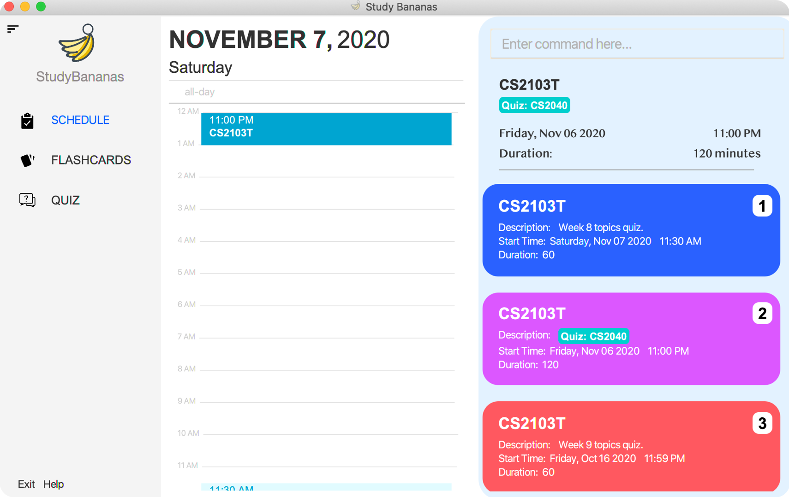
  <h1>Manage your study plans</h1>
  
Manage all of your study tasks in StudyBanans. Then, start to plan yourself for the upcoming exams!

[How to manage tasks in StudyBananas schedule >](#33-schedule)

---

  

  <h1>Create your own notes with flashcards</h1>
  
Take note with the flashcards, and organize notes using flashcard sets!

  

  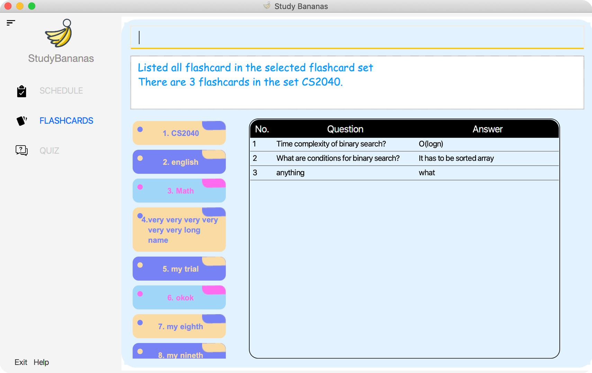

[How to manage flashcards in StudyBananas >](31-flashcard)

---

  
  <h1>Quiz yourself by flashcards</h1>
  
Prepare your exams by quizing yourself the flashcard notes that you have taken!

[How to take a flashcard quiz in StudyBananas >](#32-quiz)

<h2>Table of Contents</h2>

- [1. Introduction](#1-introduction)
  - [1.1 Reading this User Guide](#11-reading-this-user-guide)
    - [1.1.1 Icons and Meaning](#11-icons-and-meaning)
- [2. Quick start](#2-quick-start)
- [3. Features](#3-features)
  * [3.1. Flashcard](#31-flashcard)
    + [3.1.1. **Add a flashcard set**: `add flset`](#311-add-a-flashcard-set-add-flset)
    + [3.1.2. **Delete a flashcard set**: `delete flset`](#312-delete-a-flashcard-set-delete-flset)
    + [3.1.3. **List flashcards in a flashcard set**: `list fl`](#313-list-flashcards-in-a-flashcard-set-list-fl)
    + [3.1.4. **Add a flashcard into a flashcard set**: `add fl`](#314-add-a-flashcard-into-a-flashcard-set-add-fl)
    + [3.1.5. **Delete a flashcard in a flashcard set**: `delete fl`](#315-delete-a-flashcard-in-a-flashcard-set-delete-fl)
  * [3.2. Commands for the `QUIZ` page (Bowei)](#32-commands-for-the-quiz-page-bowei)
    + [3.2.1. **`QUIZ` of flashcard set**: `quiz flset`](#321-quiz-of-flashcard-set-quiz-flset)    
    + [3.2.2. **View last `QUIZ` attempt**: `quiz score flset`](#322-view-last-quiz-attempt-quiz-score-flset)
  * [3.3. Schedule](#33-schedule)
    + [**View the details of your task**:](#view-the-details-of-your-task)
    + [3.3.1. **Add a task**: `add task`](#331-add-a-task-add-task)
    + [3.3.2. **List tasks**: `list task`](#332-list-tasks-list-task)
    + [3.3.3. **Delete a task**: `delete task`](#333-delete-a-task-delete-task)
    + [3.3.4. **Search for a task**: `search task`](#334-search-for-a-task-search-task)
    + [3.3.5 **Edit a task**: `edit task`](#335-edit-a-task-edit-task)
  * [3.4. General Commands](#34-general-commands)
    + [3.4.1. **View all the available commands**: `help`](#341-view-all-the-available-commands-help)
    + [3.4.2. **Exit program**: `exit`](#342-exit-program-exit)
  * [**Saving the data**](#saving-the-data)
- [FAQ](#faq)
- [Command summary](#command-summary)
  - [Flashcard commands](#flashcard-commands)
  - [Quiz commands](#quiz-commands)
  - [Task list commands](#task-list-commands)
  - [General commands](#general-commands)

 

     

    
## **1. Introduction** (Binh)

Are you a student of secondary to tertiary education level,
who is a fan of **using flashcards to understand concepts**,
use your laptop often,
and would like to **schedule your study sessions efficiently**?
If so, we have the product just for you!

**StudyBananas** is a desktop study companion app that **helps you centralize your study tasks,
and caters to your recap needs through flashcard-quizzes**.
It is optimized for use via a Command Line Interface (CLI) while still
having the benefits of a Graphical User Interface (GUI).

This user guide aims to equip you with all necessary understanding to use StudyBananas effectively.

### 1.2 Reading this User Guide

Before you begin, here are some important notations that you should be aware of
when reading this user guide.

#### 1.2.1 Icons and Meaning

|                      Icon                       | Meaning                                                                                                                                                                                                        |
| :---------------------------------------------: | -------------------------------------------------------------------------------------------------------------------------------------------------------------------------------------------------------------- |
|              | Tips are just for your information. They can help you use StudyBananas more efficiently.                                                                                                                       |
|            | A note informs you of specific conditions or behaviours of a feature.                                                                                                                                          |
|  | Warnings denote extremely important details to take note of. These include irreversible actions, and important instructions that when not followed, may cause StudyBananas to crash or corrupt its data files. |

Table 1. Icons in this User Guide
  
#### 1.1.2 Markdown notations
|Markdown                                                    |Meaning
|:------------------------------------------------------:|--------------------------------------------------------------------------------------------------------------------------------------------|
|`add flset <name:setname>​`       | Commands and terminology that can be used in StudyBananas command line.|
|`index`, `name`, `title`, `time`                     | Various arguments that you can include in the command.|
|`QUIZ`, `SCHEDULE`, `FLASHCARD`, `FLASHCARDSET`                   | Various features that StudyBananas offers.|

Table 2. Markdown notations in this User Guide

--------------------------------------------------------------------------------------------------------------------

## 2. Quick start

1. Ensure you have Java `11` or above installed in your Computer.

2. Download the latest `StudyBananas.jar` from [here](https://github.com/AY2021S1-CS2103T-F12-2/tp/releases).

3. Copy the file to the folder you want to use as the _home folder_ for your StudyBananas.

4. Double-click the file to start the app. The GUI similar to the below should appear in a few seconds. Note how the app contains some sample data. 
   

5. Type the command in the command box and press `Enter` to execute it.
   Some example commands you can try:

   - **`list`** `task` : Lists all tasks

   * **`add`** `flset name:Chemistry` : Add a new empty set with name `Chemistry`.

   * **`delete`** `flset 3` : Deletes the 3rd flashcard set in the current list of flashcard sets.

   * **`add`** `task T:CS2100 d: Pipeline tutorial t:2020-10-10 11:00` : Adds Doing CS2100 task to the task list.

6. Refer to the [Features](#3-features) below for details of each command.

---

## 3. Features

**Notes about the command format:** (Binh)
  

* Words wrapped with angled brackets `<>` contain compulsory parameters or prefix-parameter pairs to be supplied by you. 
  e.g. In `add <flset:setname>`, `flset:` is a prefix and `setname` is a parameter, which can be used as `add flset:Chemistry`.

* Words wrapped with square brackets `[]` contain optional parameters or prefix-parameter pairs to be supplied by you. 
  e.g. In `add task <T:title> [d:description]`, `d:` is a prefix with `description` as a parameter, and can be used as `add task T: CS2103T d: Post-lecture quiz` or as `add task T: CS2103T`. 

* Prefix-parameter pairs can be in any order. 
  e.g. If the command specifies `<flset:setindex> <q:question> <a:answer>`, `<a:answer> <q:question> <flset:setindex>` is also acceptable.

* The same prefix-parameter can be used in a same command, however only the value of the last pair is used.  
e.g. In `add task T: CS2103T d: Tutorial Week 2 T: CS2100`, there are 2 parameters for `T:` but only the last one `CS2100` is taken as the input value. 

&nbsp;

### 3.1. Flashcard

#### 3.1.1. **Add a flashcard set**: `add flset`

Creates a new flashcard set with your customary name, which can then serve as folder to store and categorize your flashcards.

Format: `add flset <name:setname>​`

- `<setname>` can accept names separated with spaces.
- if `<setname>` is already used, the app will request a new `<setname>`.

Examples:

- `add flset name:Japanese`
- `add flset name:Economics – Micro`

&nbsp;

#### 3.1.2. **Delete a flashcard set**: `delete flset`

Deletes an existing flashcard set and all flashcards that it contains.

Format: `delete flset <setindex>`

- `<setindex>` should be a positive integer.
- `<setindex>` will throw an error if `setindex` does not exist.

Examples:

- `delete flset 1`
- `delete flset 2`

&nbsp;

#### 3.1.3. **List flashcards in a flashcard set**: `list fl`

Shows the list of flashcards with details: question, answer and index.

Format: `list fl <setindex>`

- `<setindex>` should be a positive integer.
- `<setindex>` will throw an error if `setindex` does not exist.

Examples:

- `list fl 1`
- `list fl 2`

Alternatively, you can double-click on the flashcard set.

#### 3.1.4. **Add a flashcard into a flashcard set**: `add fl`

Adds a single flashcard with a question and an answer in a specified flashcard set.

Format:` add fl <flset:setindex> <q:question> <a:answer>`

- `<question>`, `<answer>` and `<setindex>` fields are compulsory.
- `<question>` and `<answer>` can accept strings that are capitalized or separated with spaces.
- `<setindex>` should be a positive integer.
- `<setindex>` will throw an error if `setindex` does not exist.

Examples:

- `add fl flset:1 q:konnichiwa a:hello `
- `add fl flset:2 q:Is earth flat? a:Maybe!`

&nbsp;

#### 3.1.5. **Delete a flashcard in a flashcard set**: `delete fl`

Deletes a single flashcard in a specified flashcard set.

Format: `delete fl flset:<setindex> fl:<index>`

- `<setindex>` and `<index>` fields are compulsory.
- `<setindex>` and `<index>` should be a positive integer.
- `<setindex>` and `<index>` will throw an error if either does not exist.

Examples:

- `delete fl flset:1 fl:3`

&nbsp;

### 3.2. Commands for the `QUIZ` page (Bowei)

#### 3.2.1. **`QUIZ` of flashcard set**: `quiz flset`

Are you ready to revise your concepts? This command helps you start a `QUIZ` with a `FLASHCARDSET` of your choice.

| Format                          | Examples                                       |
| ------------------------------- | ---------------------------------------------- |
| **`quiz <flset:setindex>`**     | `quiz flset:1`   `quiz flset:2`             |
| **`quiz <flset:setname>`**      | `quiz flset:CS2040`   `quiz flset:CS2103T`  |

Alternatively, if you have a `QUIZ` scheduled (see 3) of [Add a task: `add task`](#331-add-a-task-add-task)),
you may click on the highlighted `Quiz:<quizname>` label contained in the description of the `TASK` as shown below.

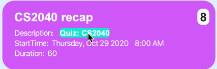

 
Note: When the `QUIZ` has started, the system is in quiz-mode. You are required to enter follow-up commands to continue with the `QUIZ`.
 

|                   | Only general and quiz-mode commands are allowed at designated times, as stated below. |
| ------------------------------------------------------ | ------------------------------------------------------------------------------------- |
| At all times in quiz-mode                              | `exit`, `help`, `cancel`, `refresh`                                                   |
| Only the question is shown (Step 1)                    | `flip`, `<ans:answer>`                                                                |
| Both the question and correct answer is shown (Step 2) | `c`, `w`                                                                              |

You will find more information on the respective quiz-mode commands in the steps below.

| Format    | Usages of all-time-available quiz-mode commands                                                                                                                                         |
| --------- | --------------------------------------------------------------------------------------------------------------------------------------------------------------------------------------- |
| `refresh` | Shows the current state of the quiz - the question, current answer (if applicable) and prompt instruction, in case you wish to continue with the quiz after entering an invalid command |
| `cancel`  | Stops the quiz. Your quiz records will not be stored upon quiz cancellation.                                                                                                            |

##### Step 1

When the `QUIZ` starts, as seen below, you will see the question
of the first `FLASHCARD` within the selected `FLASHCARDSET`,
as well as an instruction prompt to type in the next available commands,
`flip`, `<ans:answer>`, `refresh` or `cancel`.

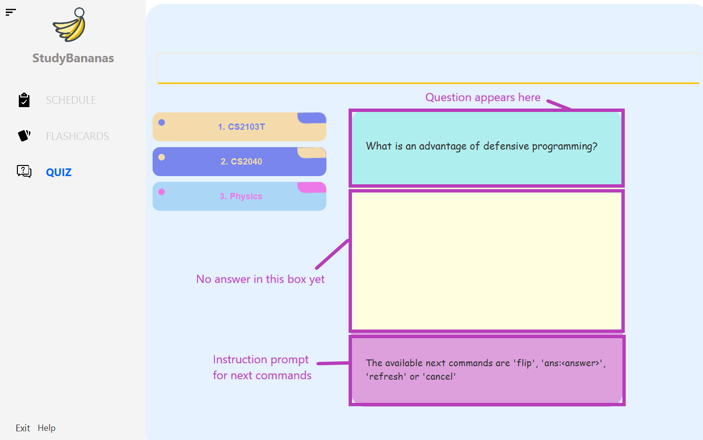

| Format         | Command usages                                                                                                                                                          |
| -------------- | ----------------------------------------------------------------------------------------------------------------------------------------------------------------------- |
| `flip`         | Does not store your answer. Displays the answer to the `FLASHCARD` question.   (You may opt to remember your answer for evaluation against the correct answer later) |
| `<ans:answer>` | Stores your answer. Also, displays the answer to the `FLASHCARD` question.                                                                                              |

##### Step 2

If the command entered is `flip` or `ans:<answer>`,
the correct answer will be displayed,
and you will be prompted to enter the next available commands, `c`, `w`, `refresh` or `cancel`.

The image below shows the result when `ans:improves code quality and reduces bugs` is entered:

Based on the correct answer, you may evaluate your own answer.
If you think the question is answered correctly, type `c`.
Else, type `w`. Your response will be taken into account when tabulating the `QUIZ` score.

| Format | Command usages                                                          |
| ------ | ----------------------------------------------------------------------- |
| `c`    | Indicates that the question of the `FLASHCARD` is answered _correctly_. |
| `w`    | Indicates that the question of the `FLASHCARD` is answered _wrongly_.   |

##### Step 3

The question of the next `FLASHCARD` will be displayed.
Steps 1-2 are repeated until all `FLASHCARD`s in the `FLASHCARDSET` are displayed and answered.

Once the quiz stops, the score statistics will be displayed.
This score can also be viewed when viewing the last attempt of the flashcard set.
(see [View last quiz attempt: `quiz score flset`](#322-view-last-quiz-attempt-quiz-score-flset))

&nbsp;

#### 3.2.2. **View last `QUIZ` attempt**: `quiz score flset`

Shows the last attempt of a `QUIZ` on a specified `FLASHCARDSET`.

It contains the following information:

- Score (percentage out of 100%), and
- List of questions each followed by answers from the last attempt
- Indicators of whether the question is answered correctly (shown as tick and cross)

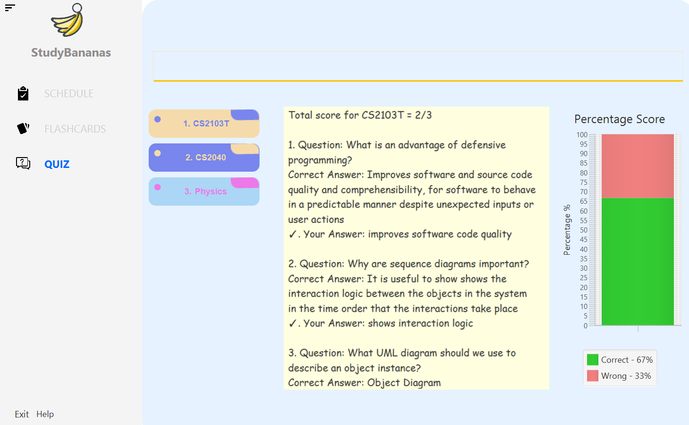

| Format                                | Examples                                                    |
| ------------------------------------- | ----------------------------------------------------------- |
| **`quiz score <flset:setindex>`**     | `quiz score flset:13`   `quiz score flset:5`             |
| **`quiz score <flset:setname>`**      | `quiz score flset:CS2103T`   `quiz score flset:Physics`  |

&nbsp;

### 3.3. Schedule (Binh)

#### **View the details of your task**: (Eddy)

There are several panels in our user interface that provides the details of your task.

- Firstly, the time scale lists out all of your study sessions which are tasks with start time and duration, you can click on your study session on the time scale to view the detail on the top right panel.
- Secondly, the list panel located at the bottom right corner of the schedule tab lists all of your tasks, you can scroll down to view the details of your task or takes advantage of our search feature (please refer to [search task section](#334-search-for-a-task-search-task)) to quickly a specific task.
- In the following user guide, we would time scale to refer to the middle panel of schedule tab, and uses task lists to refer to the bottom right panel.

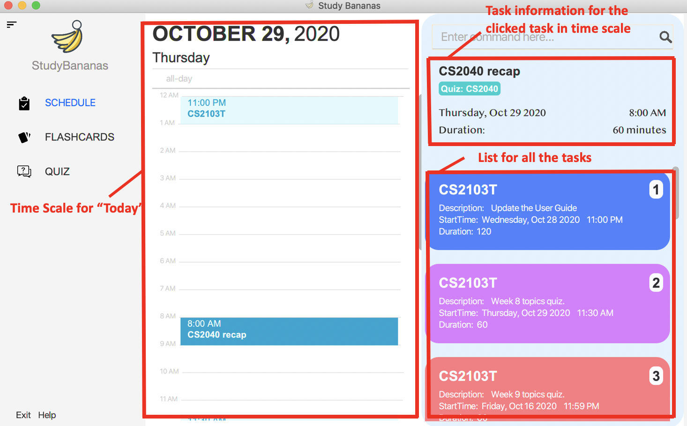

&nbsp;

#### 3.3.1. **Add a `TASK`**: `add task`

If you would like to add a study `TASK` to your `SCHEDULE`, this command allows you to create a `TASK` and saves it to the 
`SCHEDULE`, while specifying the `title`, `description`, `time` and `duration` of the task.  

After you add a new `TASK` to StudyBananas, the `TASK`'s information is saved in the `schedule.json` file.

You can also add a `QUIZ` as a valid `TASK` by entering the `quiz <flset:index>` command in the `description` field. 

| Format  | `add task <T:title> [d:description] [t:time] [dur: duration]`                                                     |
|---------|:-------------------------------------------------------------------------------------------------------------------|
| Example | `add task T: CS2100 d: Pipeline tutorial dur: 45`   `add task T: CS2103T d: iP submission t: 2020-09-17 23:59`   `add task T: CS2105 d: quiz flset:2 t: Saturday, Oct 31 2020 13:00 dur: 120`|

 

| <!-- -->    | <!-- -->    |
|-------------|-------------|
| | • `title` and `description` can accept strings that are capitalized or separated with spaces.    • The hours and minutes in `time` are optional. If you do not specify it, StudyBananas will set the time to 12:00 by default.   •  `time` should be written in one of the following formats: 
&nbsp;&nbsp;&nbsp;&nbsp; • `yyyy-MM-dd [HH:mm]` (24-hour format, e.g. 23:00)
  
&nbsp;&nbsp;&nbsp;&nbsp; • `EEEE, [MMM-dd-yyyy] [HH:mm]` (24-hour format, e.g. 23:00)
 • `duration` has to be a positive integer in minute and its value has to be less than _1440_ (number of minutes in a day).  • You cannot add a `TASK` such that it results in a duplicated `TASK`, which are `TASK`s having the same title, description, time and duration.   • You cannot add a `TASK` such that its time range overlaps with the time range of existing `TASK`s in the `SCHEDULE`.       |

 

**Expected Outcome**:  
##### 3.3.1.2. Adding a normal `TASK`
For example, you would like to add a `TASK` to your `SCHEDULE` with the `title` _CS2100_, `description` _Lab 8_, `time` 
_2020-10-29 10:00_ and `duration` of _60_ minutes.

Entering the command `add task T: CS2100 d: Lab 8 t: 2020-10-29 10:00 dur: 60` while on `SCHEDULE` page will add the `TASK` 
to your `SCHEDULE`.

1\. Enter the `add task` command, including the specific information of the `TASK`.
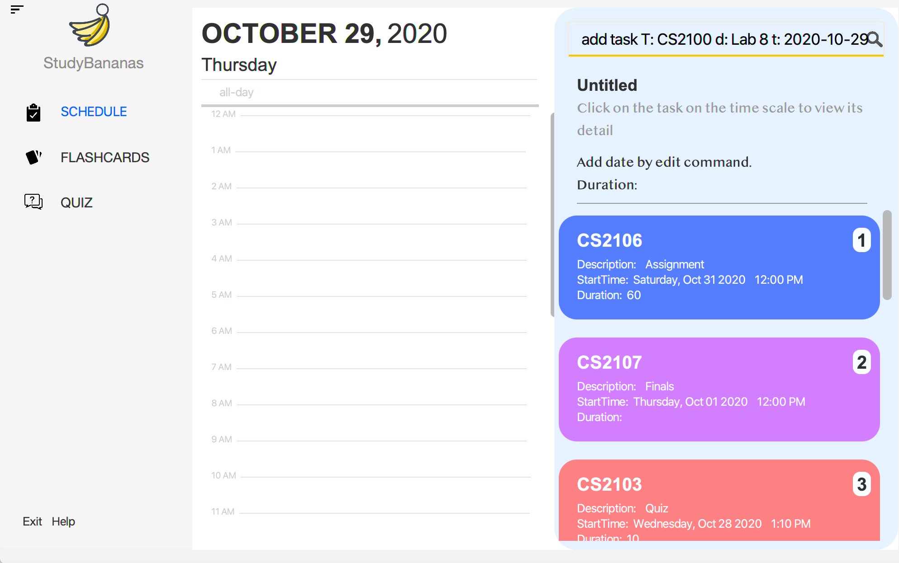  

 Figure __. Using `add task` command
  
 

2\. After using the `add task` command, the new `TASK` will be added to the end of your `SCHEDULE` by default.
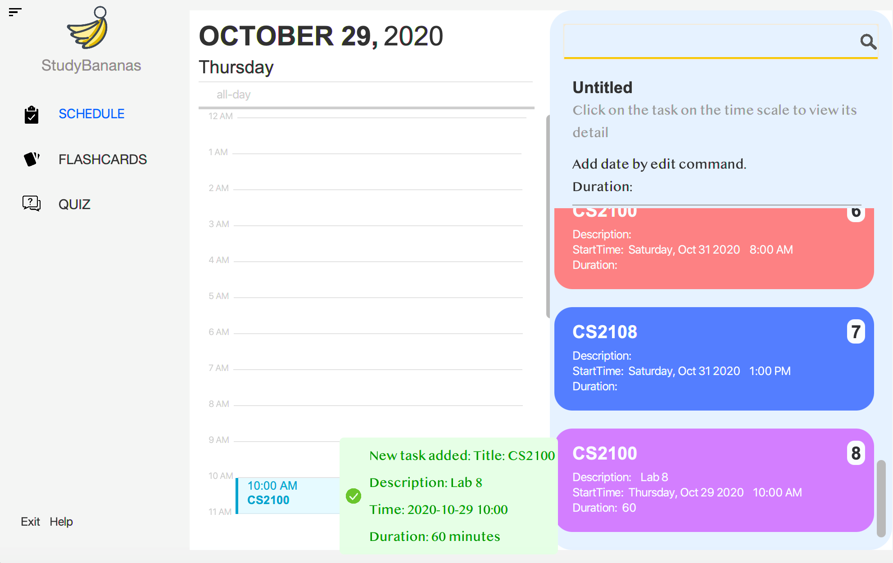  

Figure __. Result of `add task` command
    
 
&nbsp;

##### 3.3.1.2. Adding a `QUIZ` `TASK`
Now, if you would like to add a `QUIZ` of `FLASHCARDSET` 1 as a `TASK` to your `SCHEDULE`.

Entering the command `add task T: CS2040S d: quiz flset:1 dur: 30` while on `SCHEDULE` tab will add the `TASK` containing
the `QUIZ` to your schedule.

1\. Enter the `add task` command, including the specific information of the `TASK`.
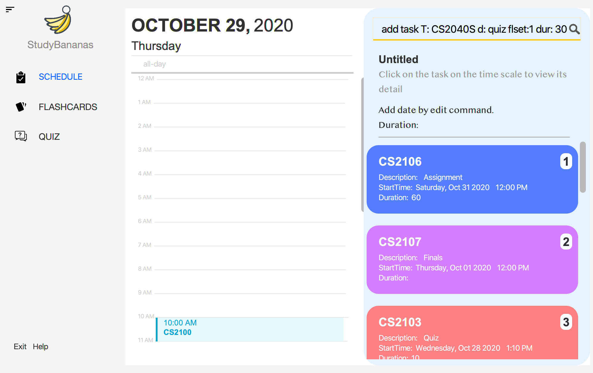  

Figure __. Using `add task` command integrate with `quiz`
  
 

2\. After using the `add task` command, the new `TASK` of doing the `QUIZ` will be added to the end of your `SCHEDULE`.
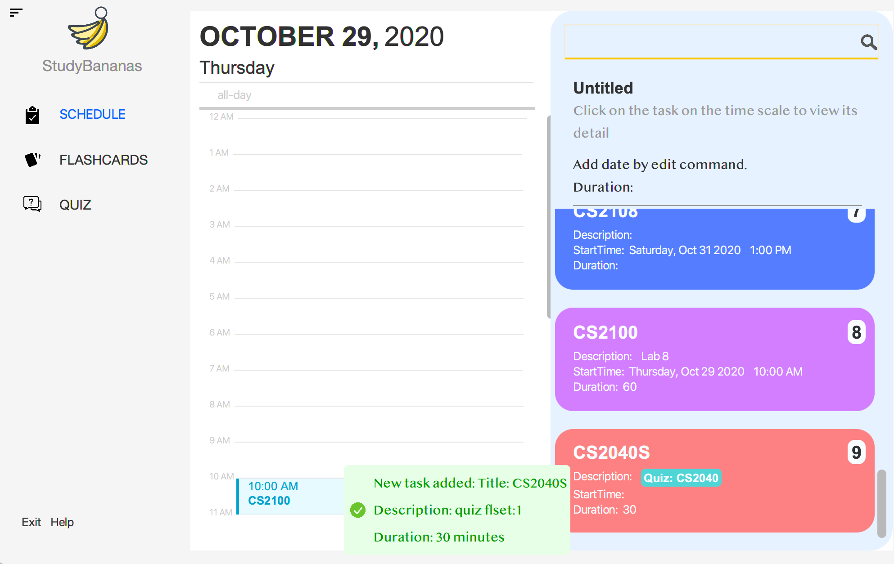  

Figure __. Result of `add task` command integrating with `quiz`
    
 

3\. Click on the highlighted `Quiz CS2040` box in the `description` of the `TASK` will redirect you to the `QUIZ` tab and start the `QUIZ` immediately for you.  
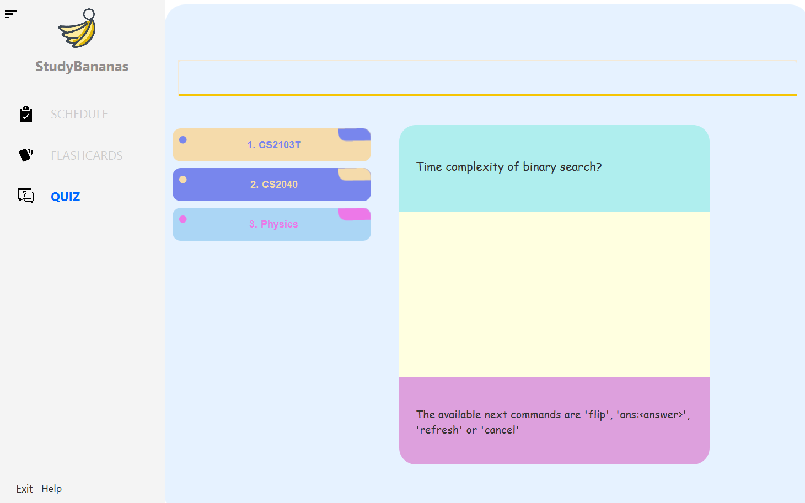  

Figure __. Result of clicking on the `Quiz CS2040` box

&nbsp;

#### 3.3.2. List all your `TASK`s: `list task`

If you  would like to view your full `SCHEDULE`, this command displays the full `SCHEDULE` that you are having at the moment.  
 
| Format  | `list task`|
|---------|:-----------|
| Example | `list task`|

 

**Expected Outcome**:  

1\. Enter the command `list task`.
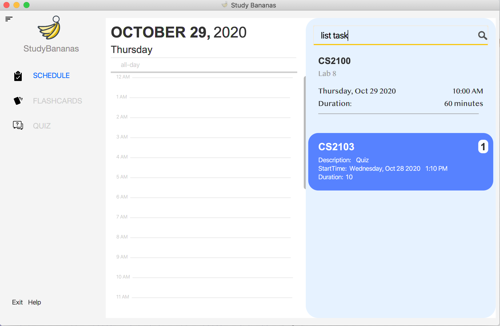  
  

Figure __. Using `list task` command on `SCHEDULE` tab
    
 

2\. After using the `list task` command, you can see the full `SCHEDULE`.
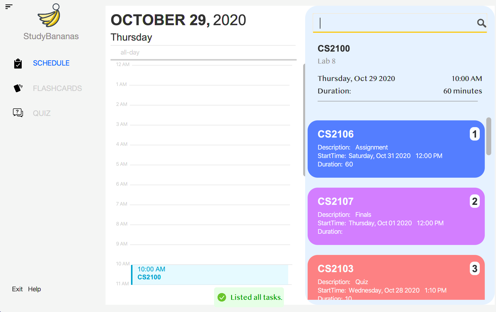  

Figure __. Result of `list task` command
  

&nbsp;

#### 3.3.3. **Delete a `TASK`**: `delete task`

If you complete a `TASK` and would like to remove that specific `TASK` from your `SCHEDULE`, this command helps you remove the task at the specified `index`.  

Upon deletion of the `TASK`, the saved information of the `TASK` in `schedule.json` file will be deleted as well.  

| Format  | `delete task <index>`|
|---------|:---------------------|
| Example | `delete task 2`      |

 

| <!-- -->    | <!-- -->    |
|-------------|-------------|
| | • The `index` refers to the index number shown in the fully displayed `SCHEDULE` after you [list task](#332-list-tasks-list-task)   • The index must be a positive integer 1, 2, 3, …​ and within range of the number of `TASK` you have in your `SCHEDULE`.|
|    |   • This action is irreversible. Once you delete a specific `TASK`, the `TASK` and its respective information are removed from the storage file as well.      |
 

**Expected Outcome**:   

For example, you just finished the `TASK` at `index` 4 in the `SCHEDULE`, _CS2100 Lab_ and you 
would like to update your `SCHEDULE` by deleting that `TASK`.  

1\. Find the `index` of the `TASK` to be deleted with the [list task](#332-list-tasks-list-task) command.

2\. From the figure below, you can identify the `TASK` to be deleted has an `index` of 4, enter the command `delete task 4`.  
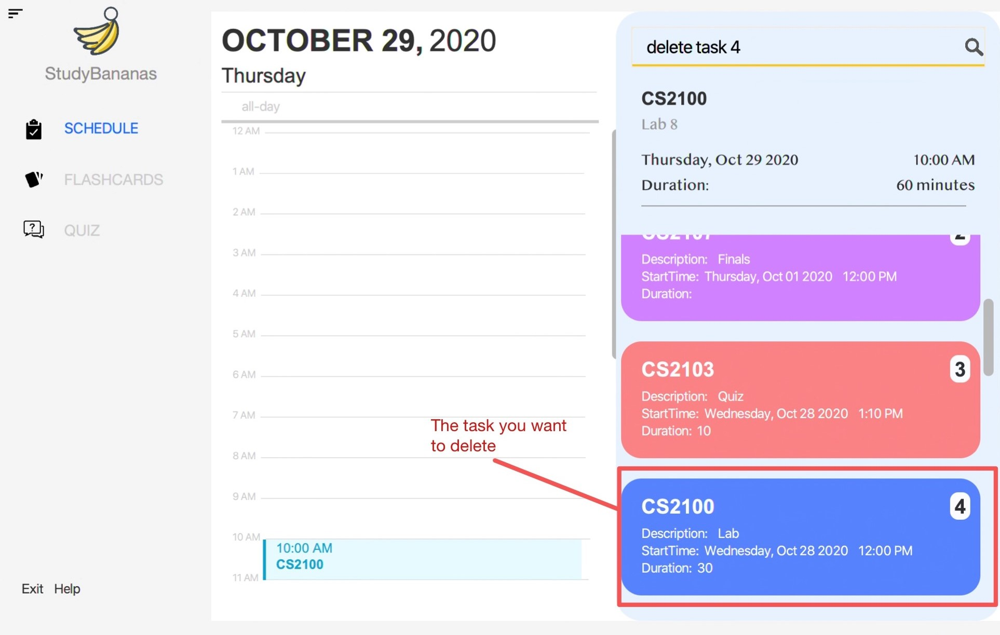

Figure __. Using `delete task` command
  
 

3\. After using the `delete task` command, the specified `TASK` is removed from your `SCHEDULE`.  
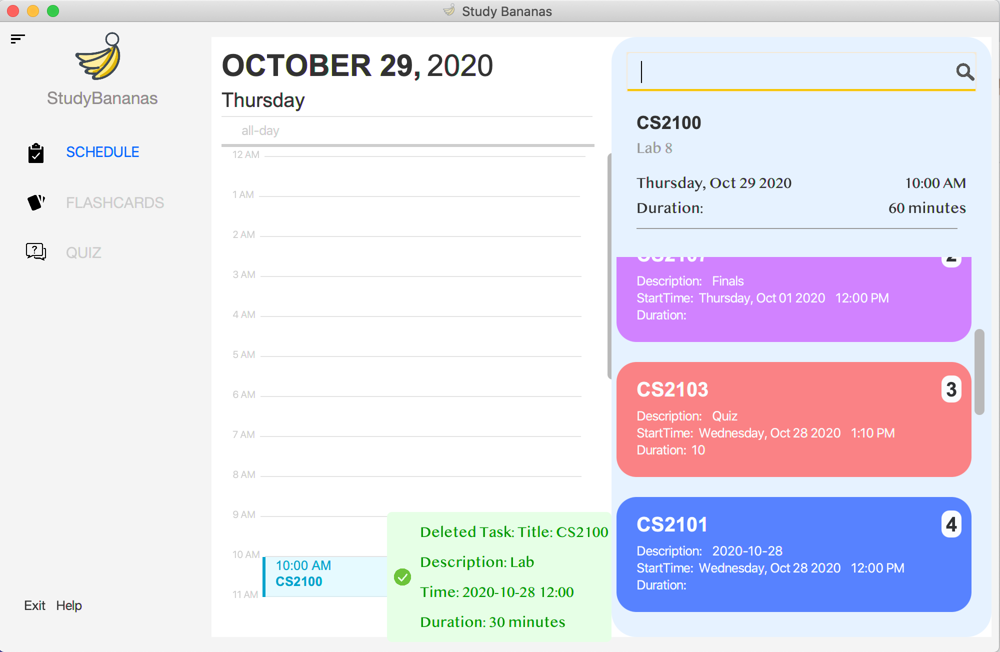  

Figure __. Result of `delete task` command
  

 

#### 3.3.4. **Search for a `TASK`**: `search task`

If you have trouble finding certain specific `TASK`s, you can search for them using a certain **keyword(s)**, this command displays any `TASK` that its `title`
contains *any* of the given **keyword(s)** or its `description` and `time` contains *all* of the given **keyword(s)**. 

| Format  | `search task <keywords>` |
|---------|:---------------------|
| Example | `search task CS2103T PE`     `search task Normal distribution assignment`    `search task 2020-11-10`  |

 

| <!-- -->    | <!-- -->    |
|-------------|-------------|
| | • The search **keyword(s)** is case-insensitive. For instance, `homework` matches `HomeWork`.   • The search requires a complete match of the **keyword**. For instance, `CS2103` does not match `CS2103T` as they are not a complete match.|

 

**Expected Outcome**:  

For example, you would like to search for a `TASK` in the `SCHEDULE` with the **keyword** *Lab 8*. StudyBananas 
searches for all `TASK`s containing *Lab 8* in their `title`, `description` and `time` and displays all matching tasks.

1\. Enter the command `search task Lab 8` to search for `TASK`s with the **keyword** *Lab 8*.  
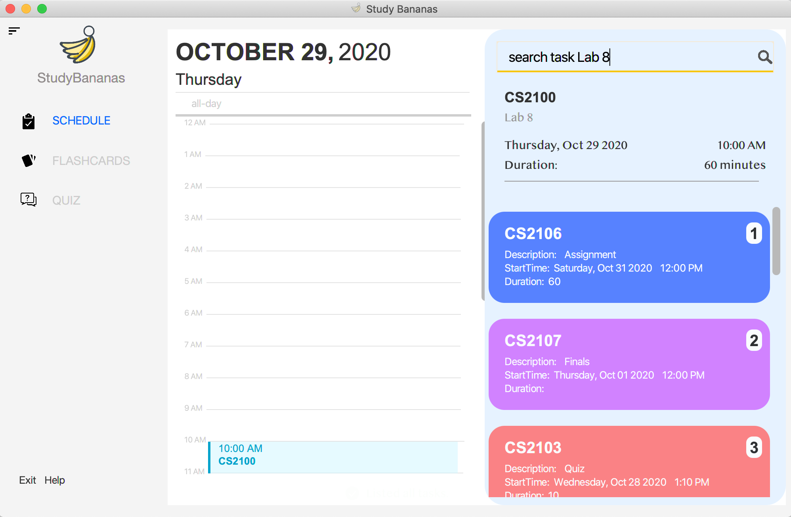  

Figure __. Using `search task` command  

 

2\. After using the `search task` command, StudyBananas displays all the `TASK`s with the
specified **keyword**  
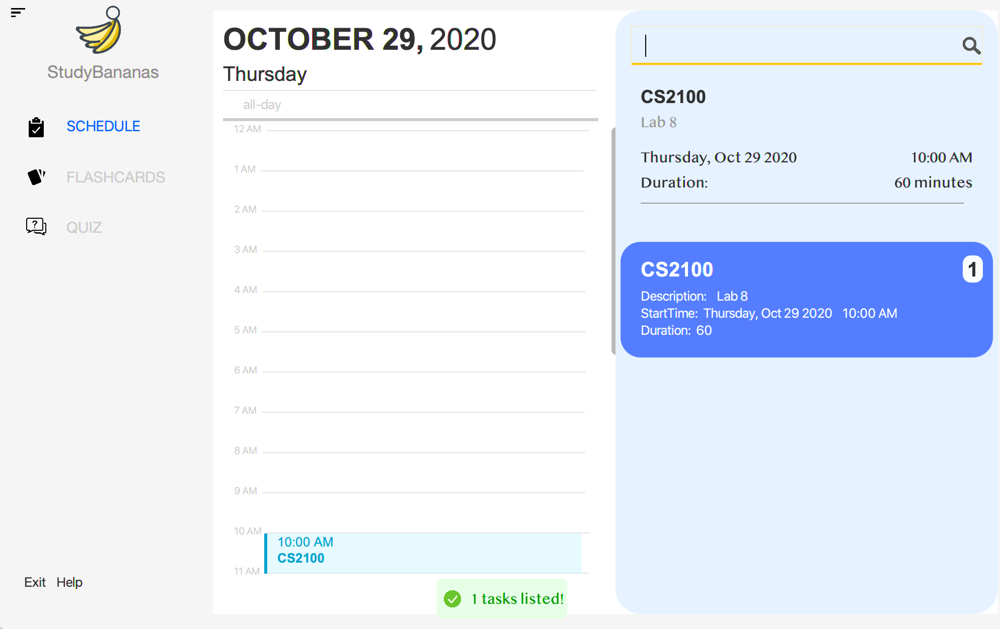

Figure __. Result of `search task` command 

&nbsp;

#### 3.3.5 Edit a `TASK`: `edit task`

If you would like to update certain details of a specific `TASK`, this command allows you to edit the details of a `TASK` at a specified `index` in the `SCHEDULE`.

You can edit a `TASK`'s `title`, `description`, `time` and `duration`.  

| Format  | `edit task <index> [T:title] [d:description] [t:time] [dur:duration]` |
|---------|:---------------------|
| Example | `edit task 1 T: Internship`   `edit task 2 d: Pipleline Tutorial homework dur: 60`    `edit task 2 d: Pipleline Tutorial homework dur: 60`  |

 

| <!-- -->    | <!-- -->    |
|-------------|-------------|
| | • The `index` refers to the index number shown in the fully displayed `SCHEDULE` after you [list task](#332-list-tasks-list-task)   • The index must be a positive integer 1, 2, 3, …​ and within range of the number of `TASK` you have in your `SCHEDULE`.   • `[title]`, `[description]`, `[time]` and `[duration]` are optional but you need to include at least one of them in the command.   • `[title]`, `[description]`, `[time]` and `[duration]` still need to conform to its respective expected format. |
|    |   • This action is irreversible. Once you edit a specific `TASK`, the `TASK`'s details are modified in the storage file as well.      |

 

**Expected Outcome**:  

For example, you previously added a `TASK`: *CS2100 Lab 8 on Thursday, Oct 29 2020 10:00 with duration 60 minutes*, which currently has 
the index of `7` in the `SCHEDULE`. Later on, you want to edit the `time` to 11:00 instead.

1\. Enter the command `edit task 7 t: Thursday, Oct 29 2020 11:00` to edit the `TASK`.  
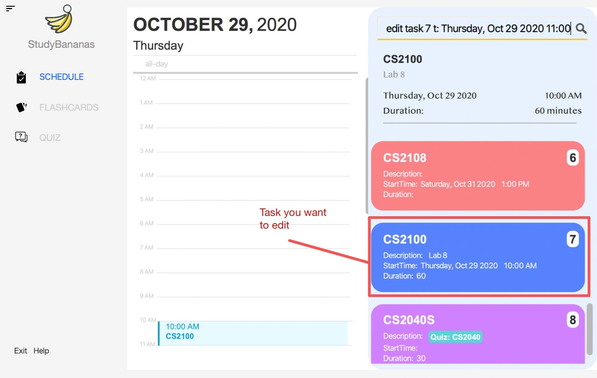  

Figure __. Using `edit task` command 

 

2\. After using the `edit task` command, the details of the `TASK` are updated accordingly.
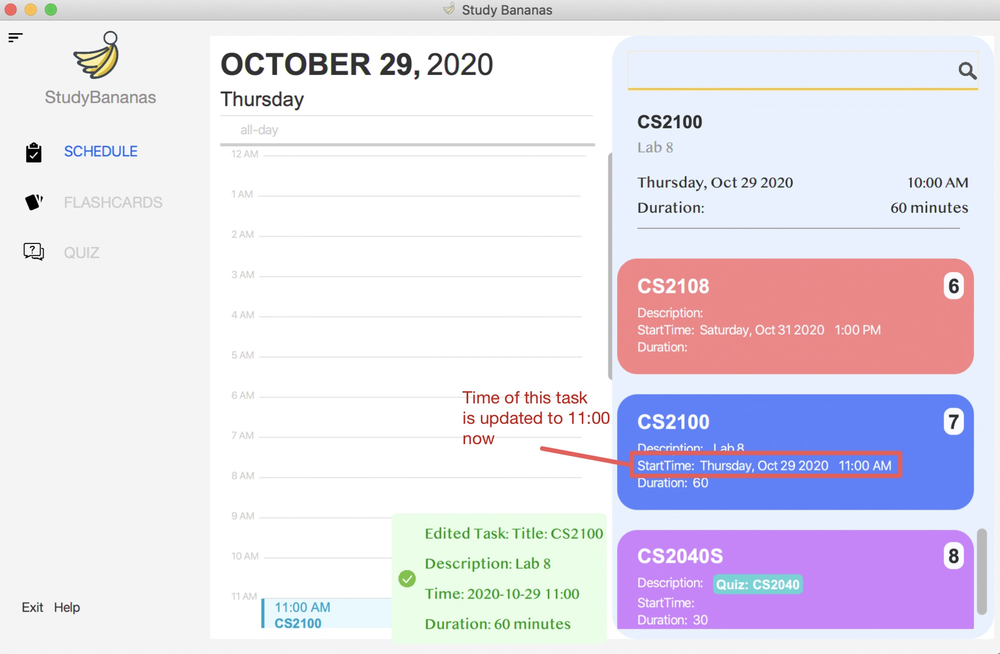  

Figure __. Result of `edit task` command, the `TASK` at `index` 7 is updated 

&nbsp;

### 3.4. General Commands (Binh)

#### 3.4.1. **View all the available commands**: `help`

If you are not sure of how a certain command works or what command would suit your needs, you can open the help window with this command to view all the available commands.  

<<<<<<< HEAD
Usage
|                 |           |
|-----------------|-----------|
|Syntax           | `help`    |
|Example          | `help`    |
|                 |           |
=======
| Format         |
| -------------- |
| **`help`**     |
>>>>>>> a296ed598416be8fb21b142acfce28cce9aacf3d

Alternatively, you can click on the help button located at the bottom of the sidebar to open the help window.

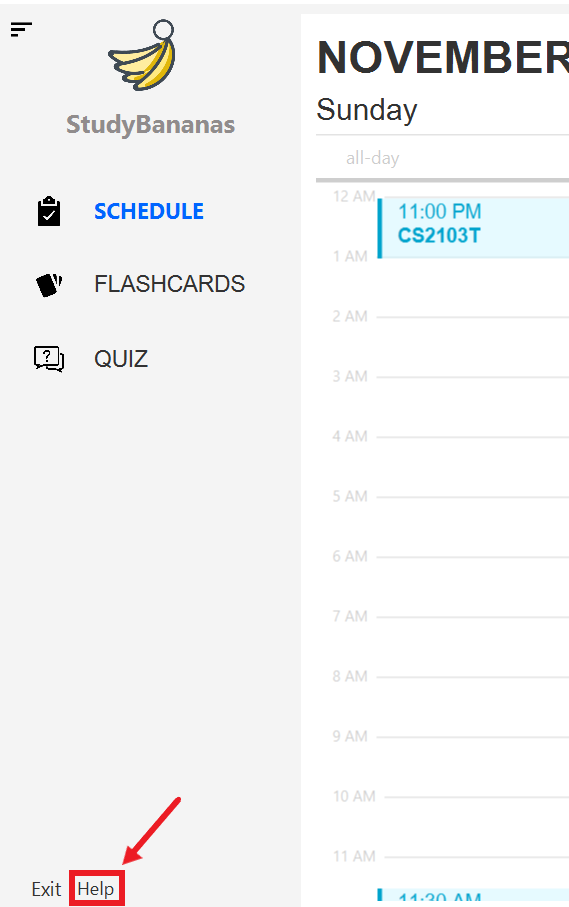

The help window shows most of the available CLI commands.

- The cyan part is the name of the command
- The purple part lists all the arguments that can be adjust in a customary manner.

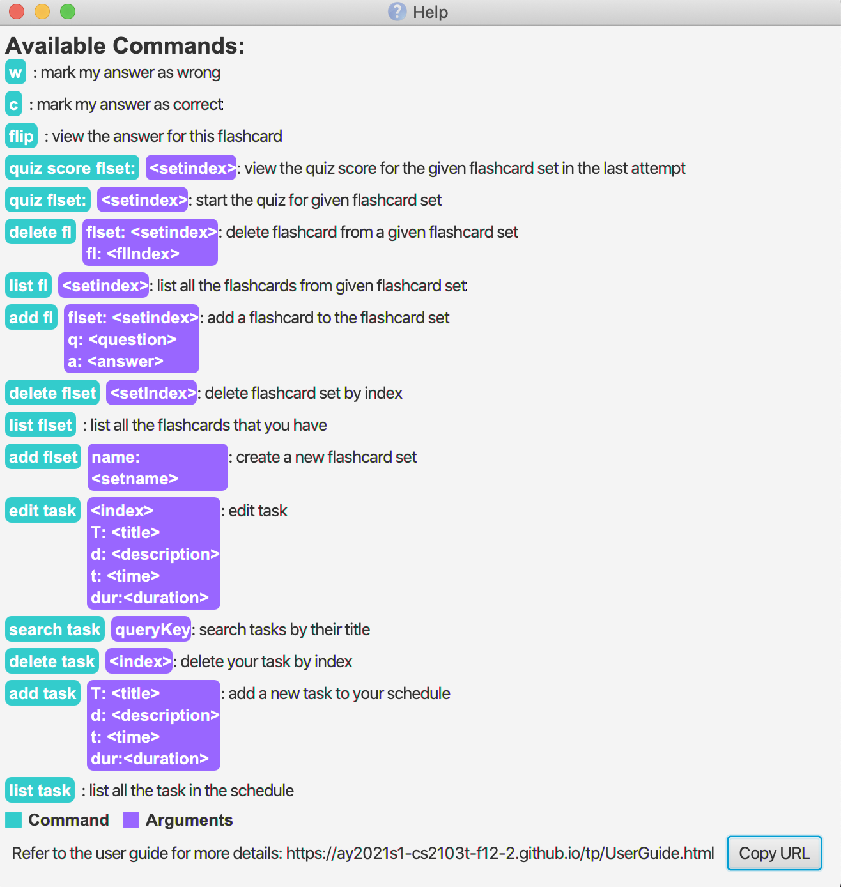

&nbsp;

#### 3.4.2. **Exit program**: `exit`

If you would like to close the application, this command helps you to quickly close StudyBanas.

| Format         |
| -------------- |
| **`exit`**     |

Alternatively, you can click on the close button located at the bottom of the sidebar to close the application.

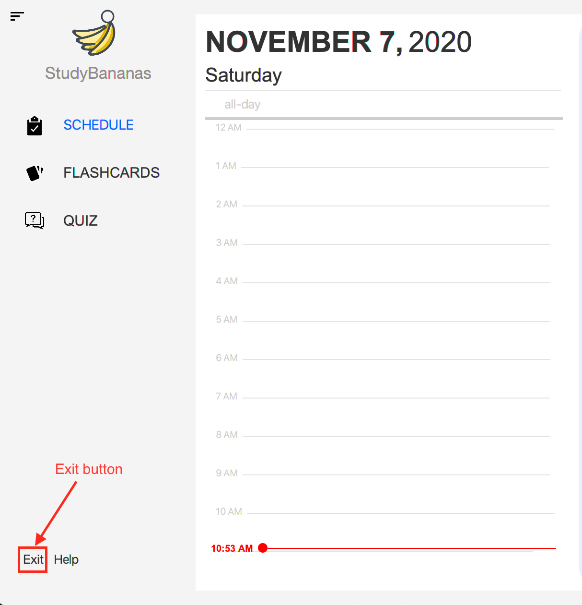

&nbsp;

### **Saving the data**

StudyBananas data are saved in the hard disk automatically after any command that changes the data. There is no need to save manually.

&nbsp;

---

## FAQ

**Q**: How do I transfer my data to another Computer? 
**A**: Install the app in the other computer and overwrite the empty data file it creates with the file that contains the data of your previous StudyBananas home folder.

---

## Command summary

### Flashcard commands

| Action                                 | Format, Examples                                                                                        |
| -------------------------------------- | ------------------------------------------------------------------------------------------------------- |
| **Add flashcard set**                  | `add flset <name:setname>`   e.g., `add flset name:Japanese`                                         |
| **Delete flashcard set**               | `delete flset <setindex>`   e.g., `delete flset 1`                                                   |
| **List flashcards in a specified set** | `list fl <setindex>`   e.g., `list fl 1`                                                             |
| **Add flashcard in a specified set**   | `add fl <flset:setindex> <q:question> <a:answer>`   e.g., `add fl flset:2 q:Is earth flat? a:Maybe!` |
| **Delete flashcard in specified set**  | `delete fl <flset:setindex> <fl:index>`   e.g., `delete fl flset:1 fl:1`                             |

&nbsp;

### Quiz commands

| Action               | Format, Examples                                                                                                                                                                              |
| -------------------- | --------------------------------------------------------------------------------------------------------------------------------------------------------------------------------------------- |
| **Quiz flset**       | `quiz <flset:setindex>` e.g., `quiz flset:7`.   `quiz <flset:setname>` eg., `quiz flset:Japanese`.   Available only in quiz mode: `flip`, `<ans:answer>`, `c`, `w`, `cancel`, `refresh` |
| **Quiz score flset** | `quiz score <flset:setindex>` e.g., `quiz score flset:6`   `quiz score <flset:setname>` e.g., `quiz score flset:Economics`                                                                 |

&nbsp;

### Task list commands (Binh)

| Action              | Format, Examples                                                                                                                                                            |
| ------------------- | --------------------------------------------------------------------------------------------------------------------------------------------------------------------------- |
| **Add task**        | `add task <T:titile> [d:description] [t:time] [dur:duration]`   e.g. `add task T:CS2103T d:iP submission t: 2020-09-17 23:59` |
| **List tasks**      | `list task`                                                                                                                                                              |
| **Delete task**     | `delete task <index>`   e.g., `delete task 6`                                                                                                                            |
<<<<<<< HEAD
| **Search for task** | `search task <keywords>`   e.g., `search task CS2103T deadlines`                                                                                                                   |
| **Edit task**       | `edit task <index> [T:title] [d:description] [t:time] [dur:duration]`   e.g. `edit task 1 d: Debug remaining errors dur: 60`                  |
=======
| **Search for task** | `search task <keywords>`   e.g., `search task CS2103T`                                                                                                                   |
| **Edit task**       | `edit task <index> [T:title] [d:description] [t:time] [dur:duration]`   e.g., `edit task 2 T: CS2103T`, `edit task 1 d: Debug remaining errors dur: 60`                  |

&nbsp;

### General commands

| Action                                    | Format, Examples      |
| ----------------------------------------- | --------------------- |
| **View all the available commands**       | `help`                |
| **Exit program**                          | `exit`                |
>>>>>>> a296ed598416be8fb21b142acfce28cce9aacf3d
