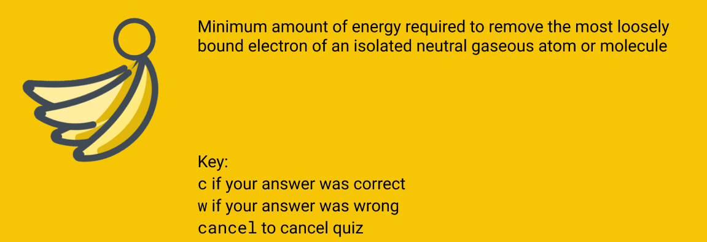

StudyBananas is a **desktop study companion app that helps students centralize all their study tasks and sets up focused study sessions into one place, optimized for use via a Command Line Interface** (CLI) while still having the benefits of a Graphical User Interface (GUI).

## Table of Contents
- [**Quick start**](#quick-start)
- [**Features**](#features)
  * [Viewing help: `help`](#viewing-help-help)
  * [Exit program: `exit`](#exit-program-exit)
  * [Add a flashcard set: `add flset`](#add-a-flashcard-set-add-flset)
  * [List all existing flashcard sets: `list flset`](#list-all-existing-flashcard-sets-list-flset)
  * [Delete a flashcard set: `delete flset`](#delete-a-flashcard-set-delete-flset)
  * [Add a flashcard into a flashcard set: `add fl`](#add-a-flashcard-into-a-flashcard-set-add-fl)
  * [List flashcards in a flashcard set: `list fl`](#list-flashcards-in-a-flashcard-set-list-fl)
  * [Delete a flashcard in a flashcard set: `delete fl`](#delete-a-flashcard-in-a-flashcard-set-delete-fl)
  * [Quiz of flashcard set: `quiz flset`](#quiz-of-flashcard-set-quiz-flset)
    + [Case 1: No storage of answers required](#case-1-no-storage-of-answers-required)
    + [Case 2: Stores the user answers to the quiz](#case-2-stores-the-user-answers-to-the-quiz)
  * [View last quiz attempt: `view flset quiz`](#view-last-quiz-attempt-view-flset-quiz)
  * [Add a task: `add task`](#add-a-task)
  * [List tasks: `list task`](#list-tasks)
  * [Delete a task: `delete task`](#delete-a-task)
  * [Search for a task: `search task`](#search-for-a-task)
  * [Saving the data](#saving-the-data)
  * [Archiving data files `[coming in v2.0]`](#archiving-data-files-coming-in-v20)
- [**FAQ**](#faq)
- [**Command summary**](#command-summary)
  * [General commands](#general-commands)
  * [Flashcard commands](#flashcard-commands)
  * [Quiz commands](#quiz-commands)
  * [Task list commands](#task-list-commands)
--------------------------------------------------------------------------------------------------------------------

## Quick start

1. Ensure you have Java `11` or above installed in your Computer.

2. Download the latest `study-bananas.jar` from [here]().

3. Copy the file to the folder you want to use as the _home folder_ for your StudyBananas.

4. Double-click the file to start the app. The GUI similar to the below should appear in a few seconds. Note how the app contains some sample data. 
   

5. Type the command in the command box and press Enter to execute it. e.g. typing **`help`** and pressing Enter will open the help window. 
   Some example commands you can try:

   * **`list`**`flset` : Lists all flashcard sets

   * **`add`**`flset Chemistry` : Add a new empty set with name `Chemistry`.

   * **`delete`**`flset:3` : Deletes the 3rd flashcard set in the current list of flashcard sets.
   
   * **`add`**`task:Do CS2100 tutorial question` : Adds Doing CS2100 task to the task list.

   * **`exit`** : Exits the app.

6. Refer to the [Features](#features) below for details of each command.

--------------------------------------------------------------------------------------------------------------------

## Features

**Notes about the command format:** 

* Words wrapped with angled brackets `<>` are the parameters to be supplied by the user. 
  e.g. in `add flset:<setname>`, `<setname>` is a parameter which can be used as `add flset:Chemistry`.

* Words wrapped with square brackets `[]` are optional parameters to be supplied by the user. 
  e.g. in `add task:<description> t:[time]`, `[time]` is an optional parameter.

* Parameters can be in any order. 
  e.g. if the command specifies `flset:<setindex> q:<question> a:<answer>`, `a:<answer> q:<question> flset:<setindex>` is also acceptable.

&nbsp;

### **Viewing help**: `help`

Lists all available commands.

Format: `help`

&nbsp;

### **Exit program**: `exit`

Exits the program

&nbsp;

### **Add a flashcard set**: `add flset`

Adds a new flashcard set.

Format: `add flset:<setname>​`
- `<setname>` can accept names separated with spaces.
- if `<setname>` is already used, the app will request a new `<setname>`.

Examples:
- `add flset:Japanese`
- `add flset:Economics – Micro`

&nbsp;

### **List all existing flashcard sets**: `list flset`

Shows all existing flashcard sets - index and name.

Format: `list flset`

&nbsp;

### **Delete a flashcard set**: `delete flset`

Deletes an existing flashcard set and all flashcards that it contains.

Format: `delete flset:<setindex>`
- `<setindex>` should be a positive integer.
- `<setindex>` will throw an error if `setindex` does not exist.

Examples:
- `delete flset:1`
- `delete flset:2`

&nbsp;

### **Add a flashcard into a flashcard set**: `add fl`

Adds a single flashcard with a question and an answer in a specified flashcard set.

Format:` add flset:<setindex> q:<question> a:<answer>`

- `<question>`, `<answer>` and `<setindex>` fields are compulsory.
- `<question>` and `<answer>` can accept strings that are capitalized or separated with spaces.
- `<setindex>` should be a positive integer.
- `<setindex>` will throw an error if `setindex` does not exist.

Examples:
- `add flset:1 q:konnichiwa a:hello `
- `add flset:2 q:When demand goes up, what happens to price? a:Price increases`

&nbsp;

### **List flashcards in a flashcard set**: `list fl`

Shows the list of flashcards with details: question, answer and index.

Format: `list fl:<setindex>`

- `<setindex>` should be a positive integer.
- `<setindex>` will throw an error if `setindex` does not exist.

Examples:
- `list flset:1`
- `list flset:2`

&nbsp;

### **Delete a flashcard in a flashcard set**: `delete fl`

Deletes a single flashcard in a specified flashcard set.

Format: `delete flset:<setindex> fl:<index>`

- `<setindex>` and `<index>` fields are compulsory.
- `<setindex>` and `<index>` should be a positive integer.
- `<setindex>` and `<index>` will throw an error if either does not exist.

Examples:
- `delete flset:1 fl:3`

&nbsp;

### **Quiz of flashcard set**: `quiz flset`
Shows the questions of the specific flashcard set. Depending on the user command, it may prompt for answers to store them for reference in the last attempt. Follow-up commands are required to continue with the quiz.

&nbsp;

#### **CASE 1**: No storage of answers required
Format: `quiz flset:<setindex>`

Examples: 
`quiz flset:2`, `quiz flset:3`

As seen below, the first question of the first flashcard within the flashcard set appears, as well as a prompt for the user to type in the next command, `flip` or `cancel`.

- `flip`: Displays the answer to the flashcard question.
- `cancel`: Stops the quiz 

If the command entered is `flip`, the correct answer will be displayed, and there will be a prompt to enter the next command, `c`, `w` or `cancel`.  

Based on the correct answer displayed, evaluate the answer provided. If the question is answered correctly, type `c`. Else, type `w`. This will be taken into account when tabulating the quiz score.

- `c`: Indicate that the question on the flashcard is answered correctly.
- `w`: Indicates that the question is answered wrongly.
- `cancel`: Stops the quiz

The next question of the next flashcard will be displayed. Steps 1-2 are repeated until all flashcards in the set are displayed and answered.

Once the quiz stops, the score will be displayed. This score can be viewed when viewing the last attempt of the flashcard set.

&nbsp;

#### **CASE 2**: Stores the user answers to the quiz
Format: `quiz flset store:<setindex>`  

Examples: 
`quiz flset store:1`, `quiz flset store:5`

As seen below, the first question of the first flashcard within the flashcard set appears, as well as a prompt for the user to type in the answer to the question, or cancel, <answer> or cancel.

- `<answer>`: Displays the answer to the flashcard question.
- `cancel`: Stops the quiz 

If the user enters the `<answer>`, the correct answer to the question will be displayed, and there will be a prompt to enter the next command, `c`, `w` or `cancel`.  

Based on the correct answer displayed, evaluate the answer provided. If the question is answered correctly, type `c`. Else, type `w`. This will be taken into account when tabulating the quiz score.

- `c`: Indicate that the question on the flashcard is answered correctly.
- `w`: Indicates that the question is answered wrongly.
- `cancel`: Stops the quiz

The next question of the next flashcard will be displayed. Steps 1-2 are repeated until all flashcards in the set are displayed and answered.

Once the quiz stops, the score and answers will be displayed. Both information can be viewed when viewing the last attempt of the flashcard set.

&nbsp;

### **View last quiz attempt**: `view flset quiz`
Shows the last attempt of a specific flashcard set.

It comprises of the following information:
- Score (percentage out of 100%), and
- List of questions each followed by answers from the last attempt
- Indicators of whether the question is answered correctly (shown as tick and cross) beside each question

Format: `view flset quiz:<setindex>`

Examples: 
`view flset quiz:9`, `view flset quiz:16`

&nbsp;

### **Add a task**: `add task`

Adds a study task to the task list.  
  
Format: `add task:<title> d:[description] t:[time]`
- `<title>` field is compulsory.
- `<title>` can accept strings that are capitalized or separated with spaces.
- `[description]` field is optional.
- `[time]` field is optional if the user wants to set a deadline or time limit for the task.

Examples:
- `add task Do CS2100 tutorial questions`
- `add task CS2103T iP submission t:17/09/2020 23:59`

&nbsp;

### **List tasks**: `list task`

Shows a list of all the added study tasks.  

Format: `list task`

Examples:
- `list task`

&nbsp;

### **Delete a task**: `delete task`

Deletes the specified task from the study bananas.  

Format: `delete task:<index>`  

Examples:
- Deletes the task at the specified index.
- The index refers to the index number shown in the displayed task list.
- The index must be a positive integer 1, 2, 3, …​

&nbsp;

### **Search for a task**: `search task`

Finds the tasks of which information contains any of the given keywords.  

Format: `search task:<keyword>`

Basic Usage: 
- The search is case-insensitive. e.g. `homework` will match `Homework`.
- The order of the keywords does not matter. e.g. `CS2103T topics` will match `topics CS2103T`.
- Start_time, period and name of the tasks are all searched.
- Partial word would match e.g. `CS2013` matches `CS2103T`.

Advanced Usage:
- `or` search: Tasks matching at least one keyword will be returned e.g. `CS2103T`, `CS2101`, `ST2334` will return `CS2103T homework`, `CS2101 homework`, and `ST2334 homework`. 
- `and` search (search is and search by default): Tasks matching all the keywords will be returned e.g. `CS2103t week 7` will return `CS2103T homework week 7`

Examples:  
`search CS2103t`  
returns `CS2103T topics quiz week 7` and `CS2103T topics quiz week 8`  
`or search CS2103t CS2101`   
returns `CS2103t topics quiz week 7` and `CS2101 OP1`

&nbsp;

### **Saving the data**

StudyBananas data are saved in the hard disk automatically after any command that changes the data. There is no need to save manually.

&nbsp;

### Archiving data files `[coming in v2.0]`

_{explain the feature here}_

--------------------------------------------------------------------------------------------------------------------

## FAQ

**Q**: How do I transfer my data to another Computer? 
**A**: Install the app in the other computer and overwrite the empty data file it creates with the file that contains the data of your previous StudyBananas home folder.

--------------------------------------------------------------------------------------------------------------------

## Command summary

### General commands

| Action               | Format, Examples |
| -------------------- | ---------------- |
| **Viewing Help**     | `help`           |
| **Exit application** | `exit`           |

&nbsp;

### Flashcard commands

| Action                                 | Format, Examples                                                                                                                         |
| -------------------------------------- | ---------------------------------------------------------------------------------------------------------------------------------------- |
| **Add flashcard set**                  | `add flset:<setname>`   e.g., `add flset:Japanese`                                                                                    |
| **List all flashcard sets**            | `list flset`                                                                                                                          |
| **Delete flashcard set**               | `delete flset:<setindex>`    e.g., `delete flset:1`                                                                                   |
| **Add flashcard in a specified set**   | `add flset:<setindex> q:<question> a:<answer>`   e.g., `add flset:2 q:When demand goes up, what happens to price? a:Price increases.` |
| **List flashcards in a specified set** | `list flset:<setindex>`   e.g., `list fl:1`                                                                                           |
| **Delete flashcard in specified set**  | `delete flset:<setindex> fl:<index>`   e.g., `delete flset:1 fl:1`                                                                    |

&nbsp;

### Quiz commands

| Action                           | Format, Examples                                                                        |
| -------------------------------- | --------------------------------------------------------------------------------------- |
| **Quiz flset (without storage)** | `quiz flset:<setindex>`   e.g., `quiz flset:7`, `flip`, `c/w`, `cancel`              |
| **Quiz flset (with storage)**    | `quiz flset store:<setindex>`   e.g., `quiz flset store:10`, `flip`, `c/w`, `cancel` |
| **View flset**                   | `view flset quiz:<setindex>`    e.g., `view flset quiz:6`                            |

&nbsp;

### Task list commands

| Action              | Format, Examples                                                                                                                           |
| ------------------- | ------------------------------------------------------------------------------------------------------------------------------------------ |
| **Add task**        | `add task:<description> t:<time>`   e.g., `add task:Do CS2100 tutorial questions`, `add task:CS2103T iP submission t: 17/09/2020 23:59` |
| **List tasks**      | `list task`                                                                                                                             |
| **Delete task**     | `delete task:<index>`    e.g., `delete task:6`                                                                                          |
| **Search for task** | `search task:<keywords>` or `search <keywords>`   e.g., `search task:CS2103T` or `search CS2103T`                                       |
